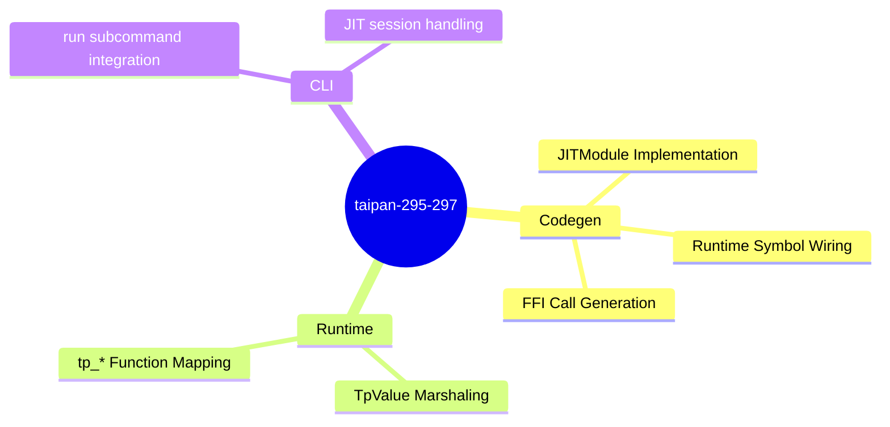

<proposal>

# Spec Navigation Map: taipan-295-297

## Scope Overview (Mindmap)

## Spec Dependency Graph (Block Diagram)

## Spec Execution Order

1. **taipan-cli-run-execution** — Taipan CLI Run Integration
   - code: crates/cclab-cli/src/taipan.rs, crates/cclab-taipan/src/driver/mod.rs
2. **taipan-jit-backend** — Taipan JIT Backend and Symbol Wiring
   - code: crates/cclab-taipan/src/codegen/cranelift/mod.rs, crates/cclab-taipan/src/driver/config.rs
3. **taipan-runtime-ffi-mapping** — Taipan Runtime FFI Mapping
   - code: crates/cclab-taipan/src/codegen/cranelift/mod.rs, crates/cclab-taipan/src/codegen/cranelift/marshal.rs

</proposal>
