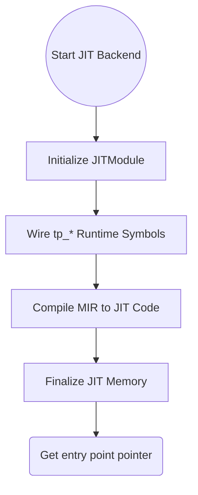

<spec>

# Taipan JIT Backend and Symbol Wiring

## Overview

This specification defines the transition of the Cranelift backend from a pure AOT ObjectModule approach to a dual-mode system that supports JIT execution via Cranelift's JITModule. It includes the logic for wiring runtime symbols (tp_*) into the JIT execution environment.

## Requirements

### R1 - JIT Module Initialization

```yaml
id: R1
priority: medium
status: draft
```

Initialize Cranelift JITModule with appropriate settings for the host platform.

### R2 - Runtime Symbol Wiring

```yaml
id: R2
priority: medium
status: draft
```

Map all runtime 'tp_*' functions to their physical memory addresses in the JIT symbol table.

### R3 - Callable Entry Point Logic

```yaml
id: R3
priority: medium
status: draft
```

Implement logic to finalize JIT compilation and retrieve a callable entry point address for compiled functions.

### R4 - Memory Management for Executable Code

```yaml
id: R4
priority: medium
status: draft
```

Ensure executable memory used by JIT functions is properly managed and freed during session shutdown.

## Acceptance Criteria

### Scenario: Successful JIT Module Init

- **GIVEN** A JIT-enabled Cranelift backend.
- **WHEN** The backend is instantiated with Backend::CraneliftJit.
- **THEN** The backend should successfully initialize a JITModule targeting the current host architecture.

### Scenario: Call Runtime Function from JIT

- **GIVEN** A compiled JIT module.
- **WHEN** A function calling 'tp_print' is executed in the JIT environment.
- **THEN** The JIT-compiled code should successfully resolve and call the runtime function at the correct address.

### Scenario: Safe Memory Cleanup

- **GIVEN** A finished JIT session.
- **WHEN** The JIT backend is dropped.
- **THEN** All executable memory regions associated with the session should be released without leaks.

## Diagrams

### JIT Compilation Flow



</spec>
