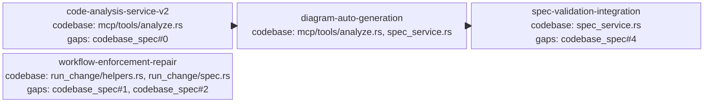

<proposal>

# Spec Navigation Map: genesis-186-28

## Scope Overview (Mindmap)

```mermaid
mindmap
  root((genesis-186-28))  
    Spec-Driven Development Core
      LLM Enrichment v2 (Requirements/Scenarios)
      --quick fast-path (AST-only) support
      AST-to-Aurora diagram mapping
    Workflow & Quality
      Strict revision thresholds (4-rejection limit)
      Mainthread escalation logic (mainthread_must_fix)
      Unified verdict models
    Validation Integration
      Spec completeness validator integration
      Aurora structured input generation
```

## Spec Dependency Graph (Block Diagram)



## Spec Execution Order

1. **code-analysis-service-v2** — Agnostic Code Analysis and LLM Enrichment Service
   - code: crates/cclab-genesis/src/mcp/tools/analyze.rs
2. **diagram-auto-generation** — AST-to-Aurora Structured Diagram Mapping
   - depends: code-analysis-service-v2
   - code: crates/cclab-genesis/src/mcp/tools/analyze.rs, crates/cclab-genesis/src/services/spec_service.rs
3. **spec-validation-integration** — Spec Completeness Validator and Aurora Integration
   - depends: diagram-auto-generation
   - code: crates/cclab-genesis/src/services/spec_service.rs, crates/cclab-genesis/src/mcp/tools/spec.rs
4. **workflow-enforcement-repair** — Unified Workflow Verdicts and Escalation Enforcement
   - code: crates/cclab-genesis/src/mcp/tools/run_change/helpers.rs, crates/cclab-genesis/src/mcp/tools/run_change/spec.rs, crates/cclab-genesis/src/mcp/tools/run_change/proposal.rs

</proposal>
