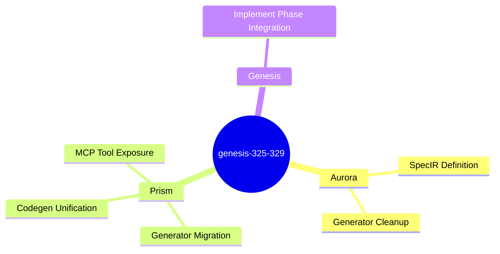

<proposal>

# Spec Navigation Map: genesis-325-329

## Scope Overview (Mindmap)

## Spec Dependency Graph (Block Diagram)

## Spec Execution Order

1. **spec-ir-contract** — SpecIR Contract Definition
   - code: crates/cclab-aurora/src/spec_ir/, crates/cclab-aurora/src/lib.rs
2. **prism-codegen-unification** — Prism Codegen Unification & Migration
   - depends: spec-ir-contract
   - code: crates/cclab-prism/src/gen/, crates/cclab-prism/src/mcp/
3. **genesis-implement-integration** — Genesis Implement Phase Integration
   - depends: prism-codegen-unification
   - code: crates/cclab-genesis/src/mcp/tools/run_change/implement.rs

</proposal>
