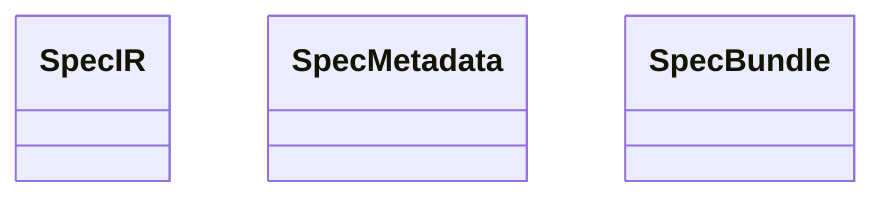

<spec>

# SpecIR Contract Definition

## Overview

Define the SpecIR (Specification Intermediate Representation) contract in cclab-aurora that serves as the universal input format for code generators in cclab-prism. SpecIR unifies structured specs (OpenAPI/JSON Schema) and diagram specs (Mermaid Plus YAML frontmatter) into a single typed representation that generators consume. This addresses GitHub issue #325 and is the foundational type for the entire spec-to-code pipeline.

## Requirements

### R1 - SpecIR enum type

```yaml
id: R1
priority: high
status: draft
```

Define a SpecIR enum in cclab-aurora/src/spec_ir/ that represents all 6 spec types from the knowledge base: ApiSpec (OpenAPI/JSON Schema), SequencePlus, FlowchartPlus (with SemanticType), ClassPlus (with Stereotype), ErdPlus (with FK/PK), RequirementPlus (with N:M mapping). Each variant wraps the existing Aurora schema types (e.g., FlowchartDef, ClassDef, ErdDef, SequenceDef).

### R2 - SpecIR metadata

```yaml
id: R2
priority: high
status: draft
```

Each SpecIR variant carries common metadata: source file path, spec group, spec ID, and a list of tags. This metadata enables generators to make routing decisions (can_generate) without parsing the full spec.

### R3 - SpecIR construction from Aurora types

```yaml
id: R3
priority: high
status: draft
```

Provide From<T> implementations to construct SpecIR from existing Aurora types: From<JsonSchema>, From<FlowchartDef>, From<ClassDef>, From<ErdDef>, From<SequenceDef>. Parsing is Aurora's responsibility; SpecIR is the output contract.

### R4 - Public API export

```yaml
id: R4
priority: medium
status: draft
```

Export SpecIR and all related types from cclab-aurora's lib.rs so that cclab-prism (which already depends on cclab-aurora) can import them directly. The types must be Serialize + Deserialize for MCP transport.

### R5 - SpecBundle for multi-spec input

```yaml
id: R5
priority: medium
status: draft
```

Define a SpecBundle struct that holds Vec<SpecIR> plus a dependency graph (which specs reference which). This allows generators to receive the complete context for a change, not just individual specs.

## Acceptance Criteria

### Scenario: Construct SpecIR from JSON Schema

- **GIVEN** A parsed JsonSchema from Aurora's schema parser
- **WHEN** SpecIR::from(json_schema) is called
- **THEN** Returns SpecIR::Api variant wrapping the schema with metadata

### Scenario: Construct SpecIR from FlowchartDef

- **GIVEN** A parsed FlowchartDef with SemanticType annotations
- **WHEN** SpecIR::from(flowchart_def) is called
- **THEN** Returns SpecIR::FlowchartPlus variant preserving SemanticType per node

### Scenario: SpecBundle with dependencies

- **GIVEN** 3 specs: an ERD+, a Class+, and an API spec where the API references the ERD entities
- **WHEN** SpecBundle is constructed with dependency edges
- **THEN** The bundle preserves the dependency graph and all 3 SpecIR variants

### Scenario: Serialize SpecIR for MCP transport

- **GIVEN** A SpecIR::Api variant
- **WHEN** serde_json::to_value is called
- **THEN** Produces valid JSON with type discriminator and all fields

## Diagrams

### SpecIR Type Hierarchy



</spec>
