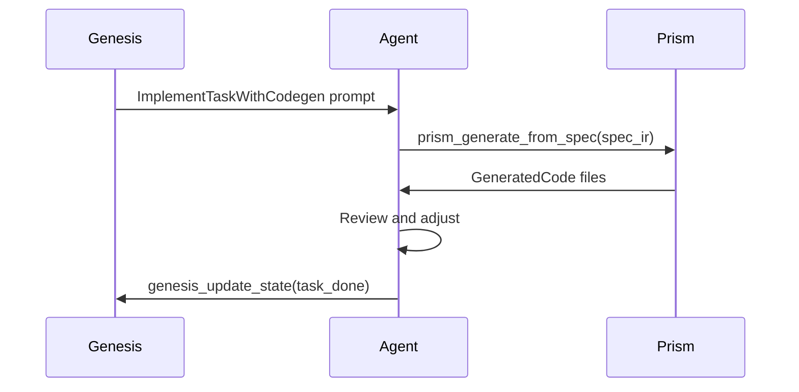

<spec>

# Genesis Implement Phase Integration with Prism Codegen

## Overview

Integrate Prism's unified code generation pipeline into Genesis's implement phase. When a task has associated specs with SpecIR representations, the implement phase should offer structured code generation via Prism MCP tools as the primary path, with manual agent coding as fallback. This addresses issue #329 and closes the spec-to-code loop: Genesis orchestrates, Aurora defines specs, Prism generates code.

## Requirements

### R1 - Detect codegen-eligible tasks

```yaml
id: R1
priority: high
status: draft
```

In implement.rs, when routing a task, check if the task's spec_ref has an associated SpecIR (by reading the spec file and checking for api_spec or diagrams fields). If SpecIR-eligible, route to structured codegen path instead of manual agent coding.

### R2 - Structured codegen prompt

```yaml
id: R2
priority: high
status: draft
```

Add a new action variant ImplementTaskWithCodegen that generates a prompt instructing the agent to: (1) read the spec, (2) call prism_generate_from_spec with the SpecIR, (3) review generated output, (4) apply any manual adjustments. The prompt includes the MCP tool signatures for Prism codegen tools.

### R3 - Fallback to manual implementation

```yaml
id: R3
priority: high
status: draft
```

If a task has no SpecIR-eligible spec or if codegen fails, fall back to the existing ImplementTask action (manual agent coding). The structured codegen path is additive, not replacing the manual path.

### R4 - Codegen result review

```yaml
id: R4
priority: medium
status: draft
```

After structured codegen, the review step (ReviewTask) should verify that generated code matches spec requirements. The review prompt includes both the spec requirements and the generated file paths for cross-referencing.

## Acceptance Criteria

### Scenario: Task with SpecIR routes to codegen

- **GIVEN** A task with spec_ref pointing to a spec that has api_spec (OpenAPI)
- **WHEN** implement.rs handle() routes this task
- **THEN** Returns ImplementTaskWithCodegen action with prompt referencing prism_generate_from_spec

### Scenario: Task without spec falls back to manual

- **GIVEN** A task with spec_ref but no api_spec or diagrams
- **WHEN** implement.rs handle() routes this task
- **THEN** Returns standard ImplementTask action (manual agent coding)

### Scenario: Codegen failure triggers fallback

- **GIVEN** Agent calls prism_generate_from_spec but it returns an error
- **WHEN** Agent reports codegen failure
- **THEN** Prompt instructs agent to proceed with manual implementation

## Diagrams

### Implement Phase with Codegen



</spec>
