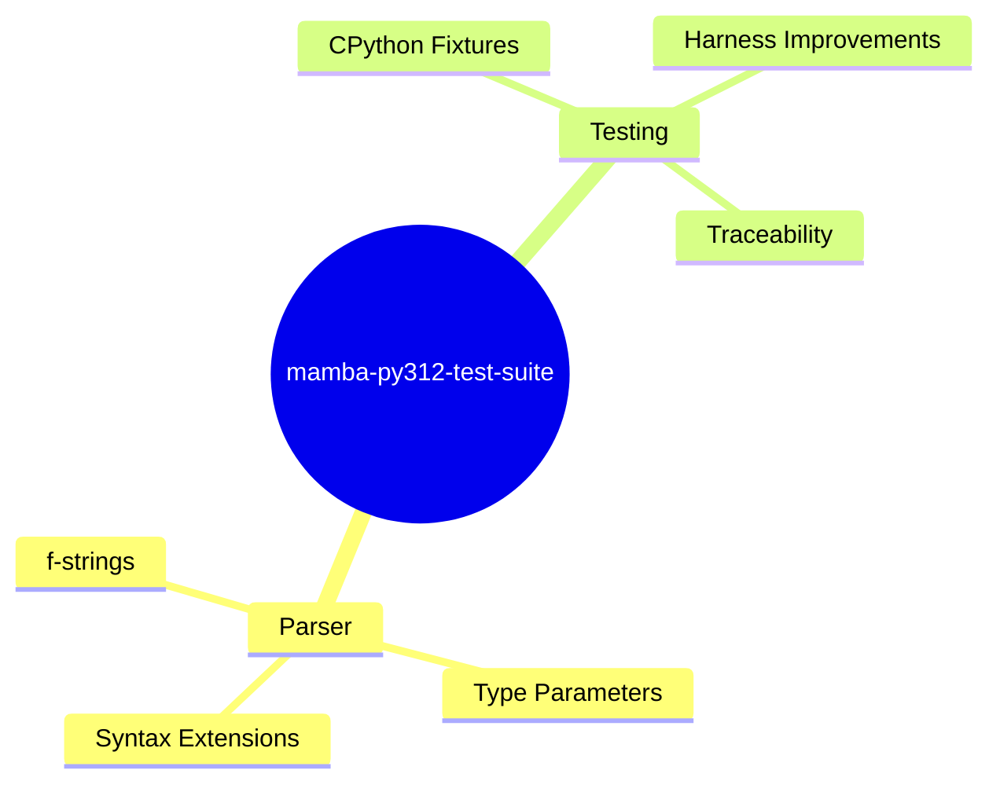
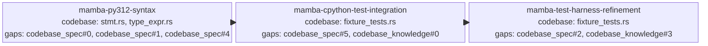

<proposal>

# Spec Navigation Map: mamba-py312-test-suite

## Scope Overview (Mindmap)

## Spec Dependency Graph (Block Diagram)

## Spec Execution Order

1. **mamba-py312-syntax** — Python 3.12 Syntax Support
   - code: crates/mamba/src/parser/
2. **mamba-cpython-test-integration** — CPython Test Integration
   - depends: mamba-py312-syntax
   - code: crates/mamba/tests/fixtures/parse/cpython/
3. **mamba-test-harness-refinement** — Test Harness Refinement
   - depends: mamba-cpython-test-integration
   - code: crates/mamba/tests/fixture_tests.rs

</proposal>
