<proposal>

# Spec Navigation Map: vortex-engine

## Scope Overview (Mindmap)

```mermaid
mindmap
  root((vortex-engine))  
    Summary & Why (Motivation)
      Implementation of Vortex high-performance 2D engine crate for Rust
      Hardware-accelerated WGPU renderer and custom ECS framework
      Cohesive full-crate delivery (ECS/Agent/Render/TD/MCP) for agent simulations
    Core Engine
      Architecture & Lifecycle
      ECS Storage Performance
    Graphics & Render (WGPU)
      2D Rendering Pipeline
      Sprite & Tilemap Systems
    AI & Orchestration
      Behavior Trees (Vortex vs Nova Boundary)
      MCP Tool Registry (Dynamic Loading)
    Gameplay Logic
      Tower Defense Mechanics
      Resource & Wave Management (Major Scope)
    Server Integration
      MCP Router (Breaking: Dynamic Tool Registry)
      Compatibility Contract (Existing Tools)
      Integration Test Gate (Router Behavior)
```

## Spec Dependency Graph (Block Diagram)

```mermaid
block-beta
  columns 3

  vortex_core_architecture["vortex-core-architecture\n codebase: crates/cclab-vortex/src/core/\n gaps: codebase_spec#2, codebase_knowledge#0, spec_knowledge#2"]
  vortex_ecs_engine["vortex-ecs-engine\n codebase: crates/cclab-vortex/src/ecs/\n gaps: codebase_spec#0"]
  vortex_render_wgpu["vortex-render-wgpu\n codebase: crates/cclab-vortex/src/render/\n gaps: codebase_spec#1"]
  vortex_agent_bt["vortex-agent-bt\n codebase: crates/cclab-vortex/src/agent/\n gaps: codebase_spec#3, spec_knowledge#0, spec_knowledge#1"]
  vortex_mcp_integration["vortex-mcp-integration\n codebase: crates/cclab-server/src/mcp/router.rs\n gaps: codebase_spec#5, codebase_knowledge#1, spec_knowledge#3"]
  vortex_td_mechanics["vortex-td-mechanics\n codebase: crates/cclab-vortex/src/td/\n gaps: codebase_spec#4"]

  vortex_core_architecture --> vortex_ecs_engine
  vortex_core_architecture --> vortex_render_wgpu
  vortex_ecs_engine --> vortex_agent_bt
  vortex_core_architecture --> vortex_mcp_integration
  vortex_ecs_engine --> vortex_td_mechanics
  vortex_render_wgpu --> vortex_td_mechanics
  vortex_agent_bt --> vortex_td_mechanics
```



## Spec Execution Order

1. **vortex-core-architecture** — Vortex Core Architecture & Lifecycle (Major: Rollout Risk)
   - code: crates/cclab-vortex/Cargo.toml, crates/cclab-vortex/src/lib.rs, crates/cclab-vortex/src/core/, Cargo.toml
2. **vortex-ecs-engine** — Vortex ECS Engine & Component Storage
   - depends: vortex-core-architecture
   - code: crates/cclab-vortex/src/ecs/
3. **vortex-agent-bt** — Vortex Behavior Tree AI System (Boundary Management)
   - depends: vortex-ecs-engine
   - code: crates/cclab-vortex/src/agent/
4. **vortex-mcp-integration** — Vortex MCP Integration & Dynamic Tool Registry (Contract: Preserve Existing Tools; Rollback: Static Fallback; Tests: Router Behavior Gate)
   - depends: vortex-core-architecture
   - code: crates/cclab-vortex/src/mcp/, crates/cclab-server/src/mcp/router.rs, crates/cclab-server/src/mcp/mod.rs, crates/cclab-server/Cargo.toml, Cargo.toml, tests/vortex_integration.rs
5. **vortex-render-wgpu** — Vortex 2D WGPU Rendering Pipeline
   - depends: vortex-core-architecture
   - code: crates/cclab-vortex/src/render/
6. **vortex-td-mechanics** — Vortex Tower Defense Gameplay Mechanics
   - depends: vortex-ecs-engine, vortex-render-wgpu, vortex-agent-bt
   - code: crates/cclab-vortex/src/td/, docs/vortex-engine/

</proposal>
