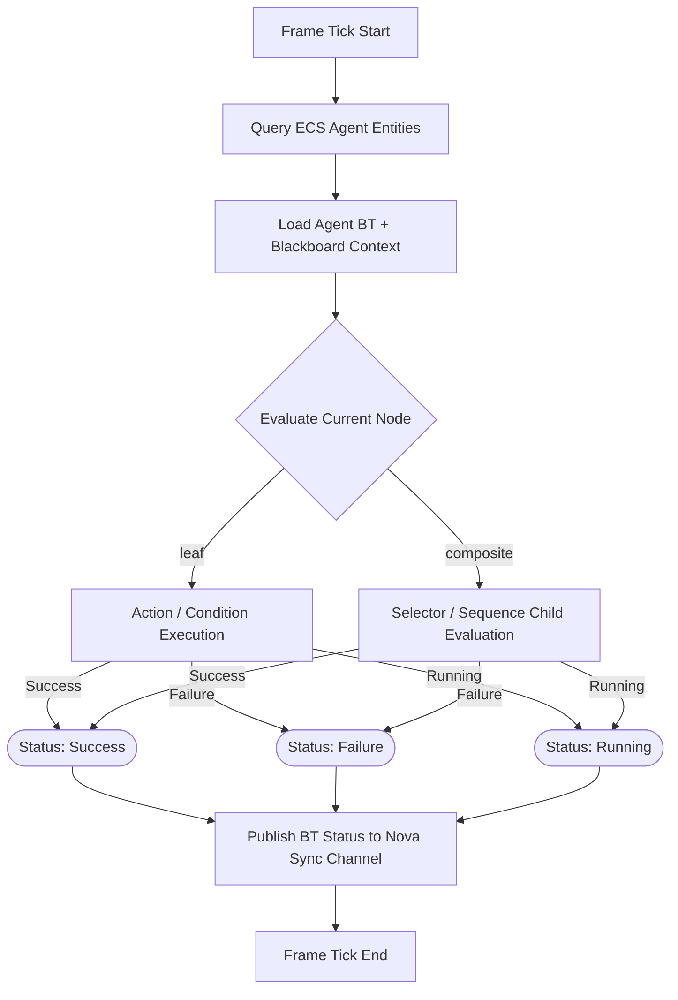
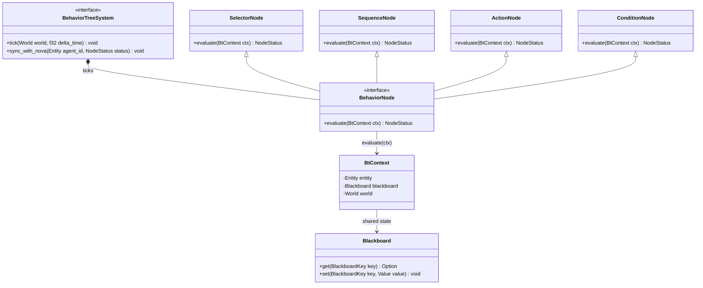

<spec>

# Vortex Behavior Tree AI System

## Overview

Define the Behavior Tree (BT) AI subsystem for Vortex agents, including node semantics (Action, Condition, Selector, Sequence), blackboard state sharing, ECS integration, and explicit coordination boundaries with Nova high-level task agents. This spec extends `vortex-ecs-engine` by defining deterministic per-frame BT evaluation for ECS entities acting as agents.

## Requirements

### R1 - Composite Nodes

```yaml
id: R1
priority: high
status: draft
```

Behavior Trees must support composite nodes `Selector` and `Sequence` with deterministic left-to-right child evaluation and standard status propagation (`Success`, `Failure`, `Running`) to enable logic branching and staged decision behavior.

### R2 - Blackboard System

```yaml
id: R2
priority: high
status: draft
```

The BT runtime must provide a blackboard for shared state across BT nodes, with scoped keys (global, per-agent) and typed access semantics. Node execution must read/write blackboard values without violating ECS borrow-safety or causing frame-order nondeterminism.

### R3 - Nova Agent Sync

```yaml
id: R3
priority: high
status: draft
```

The BT subsystem must synchronize with Nova high-level task agents by consuming intent/goal updates from Nova and exposing BT execution status back to Nova. Sync must be explicit and bounded so Nova owns strategic planning while Vortex BT owns tactical per-frame behavior execution.

### R4 - Boundary Management

```yaml
id: R4
priority: high
status: draft
```

System boundaries must enforce that Vortex owns ECS-local simulation data, ticking, and low-latency behavior evaluation, while Nova owns cross-agent orchestration, long-horizon planning, and external tool workflows. The integration contract must prevent duplicated authority over movement/targeting decisions within the same frame.

## Acceptance Criteria

### Scenario: Selector and Sequence Status Propagation

- **GIVEN** An agent tree has a `Selector` with child A returning `Failure` and child B returning `Success`, and a `Sequence` with child C returning `Success` then child D returning `Running`.
- **WHEN** `BehaviorTreeSystem` ticks both trees for the frame.
- **THEN** The selector returns `Success` from child B after evaluating left-to-right, and the sequence returns `Running` at child D while preserving cursor state for the next frame tick.

### Scenario: Blackboard Shared State Access

- **GIVEN** A condition node checks `target_visible` and an action node updates `last_known_target_position` in the same agent blackboard scope.
- **WHEN** The tree is executed during an ECS update stage.
- **THEN** Both nodes access consistent typed blackboard values within the frame, writes are visible to subsequent nodes in deterministic order, and no illegal concurrent mutable access occurs.

### Scenario: ECS Agent Integration

- **GIVEN** Entities with `BehaviorTreeComponent`, `BlackboardComponent`, and gameplay components are registered as agents.
- **WHEN** `BehaviorTreeSystem` runs in the simulation loop.
- **THEN** Only entities matching required BT components are ticked, node actions can read/write ECS components through declared access sets, and non-agent entities are excluded.

### Scenario: Nova-Vortex Boundary Enforcement

- **GIVEN** Nova sends a high-level intent `defend_lane_A` and Vortex receives it before the frame tick.
- **WHEN** The BT executes tactical decisions for movement and target selection.
- **THEN** Vortex applies tactical behavior locally and reports status (`Running`/`Success`/`Failure`) back to Nova without Nova directly mutating ECS tactical state during that same tick.

## Diagrams

### Behavior Tree Tick and Status Flow



### BehaviorTreeSystem and Node Interfaces



## Data Model

```json
{
  "agent_bt_state": {
    "properties": {
      "entity": {
        "type": "integer"
      },
      "last_status": {
        "$ref": "#/node_status"
      },
      "tree_root": {
        "type": "string"
      }
    },
    "required": [
      "entity",
      "tree_root",
      "last_status"
    ],
    "type": "object"
  },
  "blackboard_entry": {
    "properties": {
      "key": {
        "type": "string"
      },
      "scope": {
        "enum": [
          "global",
          "agent"
        ],
        "type": "string"
      },
      "value": {
        "type": "object"
      }
    },
    "required": [
      "scope",
      "key",
      "value"
    ],
    "type": "object"
  },
  "node_kind": {
    "enum": [
      "Action",
      "Condition",
      "Selector",
      "Sequence"
    ],
    "type": "string"
  },
  "node_status": {
    "enum": [
      "Success",
      "Failure",
      "Running"
    ],
    "type": "string"
  }
}
```

</spec>
