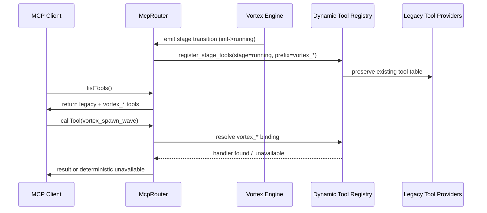

<spec>

# Vortex MCP Integration & Dynamic Tool Registry

## Overview

Define how Vortex integrates with the cclab MCP router using a dynamic, stage-aware tool registry while preserving existing Genesis/Prism/Aurora tool behavior. The design extends McpRouter with Vortex registration hooks, loads Vortex tools by engine lifecycle stage, enforces `vortex_*` namespace conventions, and guarantees non-regression for existing tool routing.

## Requirements

### R1 - Dynamic Registry

```yaml
id: R1
priority: high
status: draft
```

The router must support runtime registration and refresh of Vortex MCP tools based on Vortex engine state transitions (init, running, paused, shutdown) and feature capability gates. Stage-specific loading must expose only tools valid for the active stage and remove or disable tools that are no longer valid.

### R2 - Tool Prefixes

```yaml
id: R2
priority: high
status: draft
```

All Vortex tools must be published under the `vortex_*` prefix to provide namespace separation from existing tools. Registration logic must reject or quarantine conflicting names, and discovery output must clearly identify Vortex-owned tools as a separate namespace.

### R3 - Backwards Compatibility

```yaml
id: R3
priority: critical
status: draft
```

Dynamic Vortex registration must not disrupt existing Genesis/Prism/Aurora tool availability or routing semantics. Existing tools must remain discoverable and callable through unchanged interfaces, with deterministic routing priority and fallback behavior when Vortex tools are unavailable.

## Acceptance Criteria

### Scenario: Stage-Specific Registration on Engine Start

- **GIVEN** The MCP router has baseline Genesis/Prism/Aurora tools loaded and the Vortex engine transitions from uninitialized to running.
- **WHEN** The Vortex integration hook performs runtime registration for the running stage.
- **THEN** Only valid `vortex_*` tools for the running stage are added, existing tool namespaces remain unchanged, and discovery returns a merged tool list without collisions.

### Scenario: Namespace Collision Protection

- **GIVEN** A registration attempt includes a Vortex tool name that does not start with `vortex_*` or conflicts with an existing tool name.
- **WHEN** The router validates incoming Vortex registrations.
- **THEN** The invalid registration is rejected with a structured error, existing tool bindings are preserved, and router health remains operational.

### Scenario: Backward-Compatible Routing

- **GIVEN** Clients invoke legacy Genesis/Prism/Aurora tools after Vortex dynamic registration is enabled.
- **WHEN** Requests are routed through McpRouter.
- **THEN** Legacy tools resolve and execute with unchanged behavior, and Vortex registration does not alter legacy dispatch outcomes.

### Scenario: Graceful Fallback When Vortex Is Unavailable

- **GIVEN** The Vortex engine is not initialized or becomes unavailable during runtime.
- **WHEN** A Vortex tool call is received.
- **THEN** The router returns a deterministic unavailable response for the requested `vortex_*` tool while continuing to serve non-Vortex tools without interruption.

## Diagrams

### MCP Router Dynamic Registration and Dispatch



## API Specification (OpenAPI 3.1)

```yaml
info:
  description: Internal HTTP control surface for MCP tool discovery and dynamic Vortex registration state visibility.
  title: Vortex MCP Router Integration API
  version: 1.0.0
openapi: 3.1.0
paths:
  /mcp/tools:
    get:
      description: Returns merged tool registry including legacy tools and active-stage Vortex tools.
      responses:
        '200':
          content:
            application/json:
              schema:
                properties:
                  tools:
                    items:
                      properties:
                        name:
                          type: string
                        namespace:
                          type: string
                        stage:
                          nullable: true
                          type: string
                      required:
                      - name
                      - namespace
                      type: object
                    type: array
                required:
                - tools
                type: object
          description: Merged tool list
      summary: List all registered MCP tools
  /mcp/tools/{name}/invoke:
    post:
      parameters:
      - in: path
        name: name
        required: true
        schema:
          type: string
      requestBody:
        content:
          application/json:
            schema:
              additionalProperties: true
              type: object
        required: false
      responses:
        '200':
          description: Tool invocation success
        '404':
          description: Tool not found
        '409':
          description: Tool unavailable in current stage
      summary: Invoke a registered MCP tool
```

</spec>
