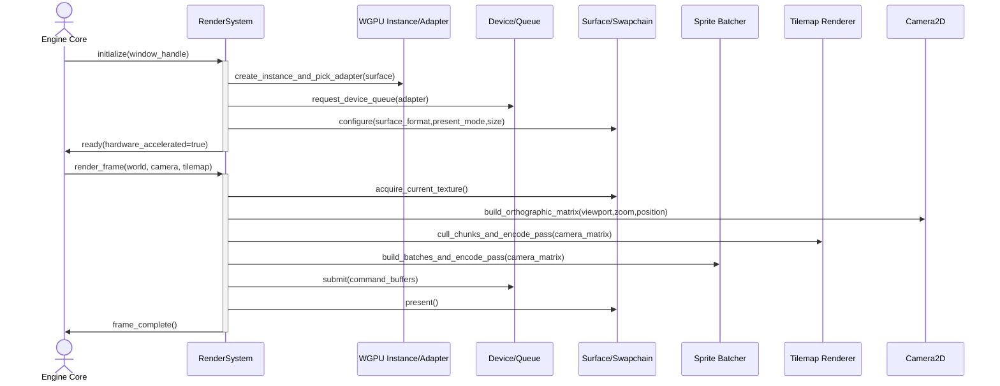

<spec>

# Vortex 2D WGPU Rendering Pipeline

## Overview

Define the 2D WGPU rendering pipeline for Vortex, including lifecycle management for WGPU instance/surface/device and frame presentation, sprite and tilemap rendering archetypes, a stable RenderSystem interface for engine integration, and hardware acceleration expectations for desktop-class GPUs.

## Requirements

### R1 - Batch Rendering

```yaml
id: R1
priority: high
status: draft
```

The renderer must implement efficient sprite drawing via GPU batch submission. RenderSystem must aggregate sprites by texture/material pipeline state, write per-instance data into dynamic GPU buffers, and minimize draw calls per frame while preserving deterministic render order where required.

### R2 - Tilemap System

```yaml
id: R2
priority: high
status: draft
```

The renderer must provide optimized static background rendering for tilemaps. Tilemap layers should be uploaded as reusable GPU buffers/textures and rendered with chunk-based culling and optional dirty-region updates so unchanged layers avoid full rebuild each frame.

### R3 - Camera System

```yaml
id: R3
priority: high
status: draft
```

The renderer must support an orthographic 2D camera projection. RenderSystem must expose camera update APIs (position, zoom, viewport) and apply a camera uniform to both sprite and tilemap passes consistently across the frame.

## Acceptance Criteria

### Scenario: WGPU Lifecycle Initialization

- **GIVEN** Engine startup creates a window and render subsystem
- **WHEN** RenderSystem::initialize() is executed
- **THEN** A WGPU instance, compatible surface, adapter, device/queue, and presentation configuration are created successfully, and the renderer reports ready state with hardware acceleration enabled.

### Scenario: Sprite Batch Submission

- **GIVEN** A frame contains many sprites across a limited set of textures
- **WHEN** RenderSystem::render_frame() processes visible sprite components
- **THEN** Sprites are grouped into batches with reduced draw calls, per-instance data is uploaded once per batch, and frame time remains within target budget for the configured scene.

### Scenario: Tilemap Static Layer Rendering

- **GIVEN** A map with static ground/background layers and a moving camera
- **WHEN** RenderSystem::render_frame() executes tilemap rendering
- **THEN** Only visible tile chunks are rendered, static layer GPU data is reused across frames, and camera movement updates final screen composition without full layer re-upload.

### Scenario: Orthographic Camera Consistency

- **GIVEN** Sprite entities and tilemap layers share world coordinates
- **WHEN** Camera position or zoom changes during update
- **THEN** Both sprite and tilemap passes use the same orthographic matrix and remain visually aligned across the viewport.

### Scenario: Surface Reconfiguration on Resize

- **GIVEN** The application window changes size
- **WHEN** RenderSystem handles resize before the next present
- **THEN** Surface configuration is updated, dependent render targets are recreated as needed, and rendering continues without device loss or undefined frame output.

## Diagrams

### RenderSystem WGPU Frame Lifecycle



</spec>
