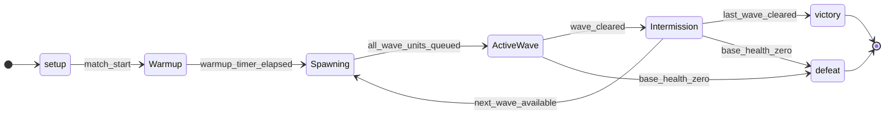

<spec>

# Vortex Tower Defense Gameplay Mechanics

## Overview

Define the tower defense gameplay layer for Vortex by composing ECS entity/component data, BT-driven turret decisions, render-facing state projection, wave orchestration, grid pathfinding, and resource progression (gold/base health). This spec extends `vortex-ecs-engine`, `vortex-render-wgpu`, and `vortex-agent-bt` with deterministic gameplay rules for per-frame simulation.

## Requirements

### R1 - Wave Spawner

```yaml
id: R1
priority: high
status: draft
```

The TD system must load configurable wave definitions and spawn creeps deterministically from schedule parameters (lane, creep archetype, count, spawn interval, start delay). Wave progression must gate next-wave activation on completion criteria and support intermission timing.

### R2 - Turret Logic

```yaml
id: R2
priority: high
status: draft
```

Turret entities must execute targeting and firing behavior through ECS + BT integration. BT conditions/actions must evaluate target validity (range, alive, lane visibility), respect attack cooldown, and emit projectile spawn commands through ECS events without violating scheduler access constraints.

### R3 - Grid-based Pathfinding

```yaml
id: R3
priority: high
status: draft
```

Creep navigation must use a grid-based pathfinding model (A* or BFS over weighted/unweighted cells) derived from ECS grid occupancy. Path cache invalidation must occur when blocking structures are built/sold, and creeps must re-route within bounded recompute cost.

### R4 - Resource Management

```yaml
id: R4
priority: high
status: draft
```

Gameplay resources must track and update `gold` and base `health` as first-class ECS state. Creep kills award gold according to creep archetype rewards, while creeps reaching the goal reduce health by configured damage. Defeat is triggered when health reaches zero.

## Acceptance Criteria

### Scenario: Configurable Wave Execution

- **GIVEN** A level config defines three waves with explicit creep types, counts, and spawn intervals.
- **WHEN** The match starts and the wave manager runs through warmup and active wave states.
- **THEN** Creeps spawn according to the configured schedule, each wave completes only after all spawned creeps are resolved, and the next wave starts after configured intermission.

### Scenario: Turret Targeting and Projectile Fire

- **GIVEN** A turret with BT controller and attack cooldown is in range of two valid creeps.
- **WHEN** The turret logic system ticks for the frame.
- **THEN** The BT selects one target using configured strategy (e.g., nearest-to-goal), consumes cooldown if ready, and emits exactly one projectile spawn with turret attack stats.

### Scenario: Path Recompute on Grid Topology Change

- **GIVEN** Creeps are traversing a grid path and a new blocking turret is built on a previously walkable cell.
- **WHEN** The pathfinding invalidation event is processed.
- **THEN** Affected creeps re-run pathfinding (A* or BFS) to the goal using updated occupancy and continue movement on the new route without entering blocked cells.

### Scenario: Gold Reward and Health Penalty

- **GIVEN** Player gold is 40, base health is 20, one creep is killed and one creep leaks to the goal in the same wave.
- **WHEN** Damage and reward resolution runs at end-of-frame.
- **THEN** Gold increases by the killed creep reward, health decreases by leak damage, and both updates are reflected in ECS resource state for HUD rendering.

### Scenario: Defeat Condition

- **GIVEN** Base health is 1 and a creep with leak damage 1 reaches the goal.
- **WHEN** Goal resolution is applied.
- **THEN** Base health becomes 0, match state transitions to Defeat, and further wave spawns are halted.

## Diagrams

### TD Gameplay Frame and Wave Loop

```mermaid
flowchart TB
    frame_start(Frame Start)
    wave_state[Wave Manager State Update]
    spawn_check{Spawn Due?} 
    spawn_creep[Spawn Creep Entities]
    grid_update[Grid Change / Path Cache Invalidate]
    path_step[Pathfinding Step (A* / BFS)]
    bt_tick[Turret BT Tick (Target + Cooldown)]
    projectile_spawn[Projectile Spawn Events]
    combat_resolve[Projectile/Creep Collision Resolve]
    resource_apply[Apply Gold + Health Deltas]
    terminal_check{Victory/Defeat?} 
    frame_end(Frame End)
    frame_start --> wave_state
    wave_state --> spawn_check
    spawn_check -->|yes| spawn_creep
    spawn_check -->|no| grid_update
    spawn_creep --> grid_update
    grid_update --> path_step
    path_step --> bt_tick
    bt_tick --> projectile_spawn
    projectile_spawn --> combat_resolve
    combat_resolve --> resource_apply
    resource_apply --> terminal_check
    terminal_check -->|no| frame_end
    terminal_check -->|yes (lock state)| frame_end
```

### Wave Lifecycle State Machine



## Data Model

```json
{
  "entities": [
    {
      "attributes": [
        {
          "key": "PK",
          "name": "entity_id",
          "type": "u32"
        },
        {
          "name": "position",
          "type": "GridCoord"
        },
        {
          "name": "range",
          "type": "f32"
        },
        {
          "name": "attack_damage",
          "type": "f32"
        },
        {
          "name": "attack_cooldown_ms",
          "type": "u32"
        },
        {
          "name": "target_strategy",
          "type": "enum"
        }
      ],
      "name": "Turret"
    },
    {
      "attributes": [
        {
          "key": "PK",
          "name": "entity_id",
          "type": "u32"
        },
        {
          "name": "archetype",
          "type": "string"
        },
        {
          "name": "health",
          "type": "f32"
        },
        {
          "name": "move_speed",
          "type": "f32"
        },
        {
          "name": "path_index",
          "type": "u32"
        },
        {
          "name": "reward_gold",
          "type": "u32"
        },
        {
          "name": "leak_damage",
          "type": "u32"
        }
      ],
      "name": "Creep"
    },
    {
      "attributes": [
        {
          "key": "PK",
          "name": "entity_id",
          "type": "u32"
        },
        {
          "name": "source_turret",
          "type": "u32"
        },
        {
          "name": "target_creep",
          "type": "u32"
        },
        {
          "name": "speed",
          "type": "f32"
        },
        {
          "name": "damage",
          "type": "f32"
        },
        {
          "name": "lifetime_ms",
          "type": "u32"
        }
      ],
      "name": "Projectile"
    },
    {
      "attributes": [
        {
          "name": "gold",
          "type": "u32"
        },
        {
          "name": "health",
          "type": "u32"
        },
        {
          "name": "current_wave",
          "type": "u32"
        },
        {
          "name": "state",
          "type": "enum"
        }
      ],
      "name": "MatchResources"
    }
  ]
}
```

## API Specification (Serverless Workflow 0.8)

```yaml
description: High-level orchestration of tower defense wave progression and terminal conditions.
id: vortex-td-match-workflow
name: vortex-td-match-workflow
specVersion: '0.8'
start: Setup
states:
- name: Setup
  type: operation
- name: Warmup
  type: sleep
- name: Spawning
  type: operation
- name: ActiveWave
  type: operation
- name: Intermission
  type: sleep
- name: Victory
  type: operation
- name: Defeat
  type: operation
version: 1.0.0
```

</spec>
