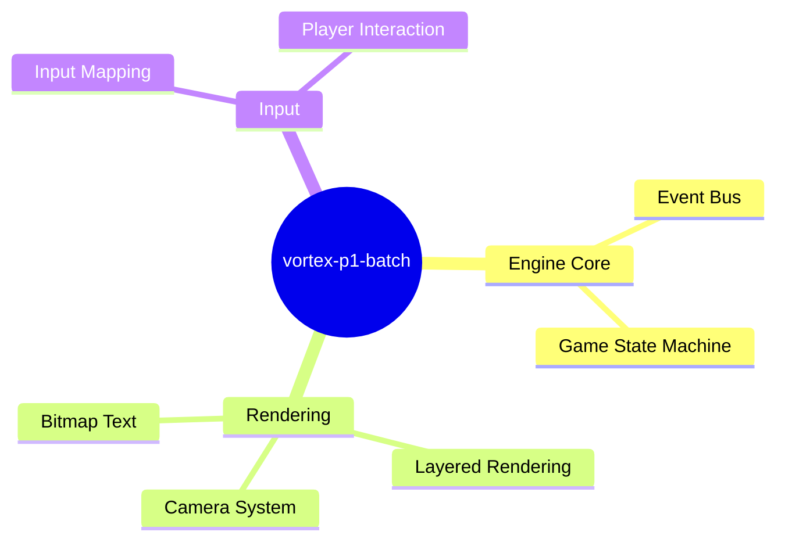
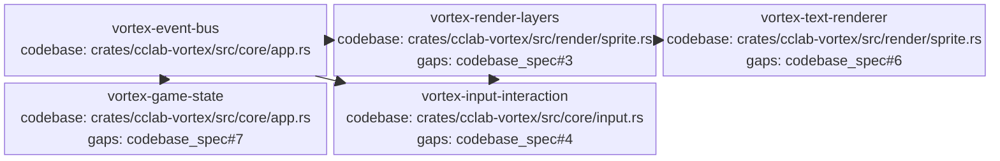

<proposal>

# Spec Navigation Map: vortex-p1-batch

## Scope Overview (Mindmap)

## Spec Dependency Graph (Block Diagram)

## Spec Execution Order

1. **vortex-event-bus** — Internal Event Bus System
   - code: crates/cclab-vortex/src/core/event.rs
2. **vortex-game-state** — Global Game State Machine
   - depends: vortex-event-bus
   - code: crates/cclab-vortex/src/core/state.rs
3. **vortex-render-layers** — Layered Rendering and Camera Integration
   - depends: vortex-event-bus
   - code: crates/cclab-vortex/src/render/layers.rs, crates/cclab-vortex/src/render/camera.rs
4. **vortex-input-interaction** — Input Mapping and Interaction
   - depends: vortex-event-bus, vortex-render-layers
   - code: crates/cclab-vortex/src/core/input.rs
5. **vortex-text-renderer** — Bitmap Text Rendering
   - depends: vortex-render-layers
   - code: crates/cclab-vortex/src/render/text.rs

</proposal>
