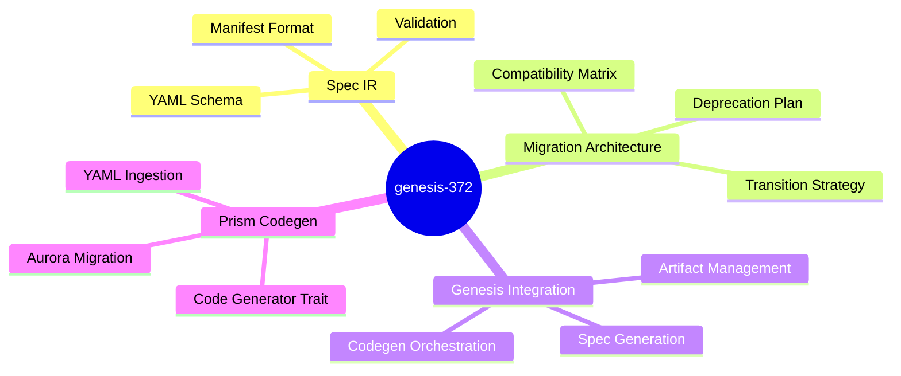
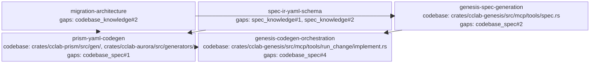

<proposal>

# Spec Navigation Map: genesis-372

## Scope Overview (Mindmap)

## Spec Dependency Graph (Block Diagram)

## Spec Execution Order

1. **migration-architecture** — Migration Architecture & Compatibility Matrix
   - code: crates/cclab-genesis/src/lib.rs, crates/cclab-genesis/src/migration.rs
2. **spec-ir-yaml-schema** — SpecIR YAML Manifest Schema
   - code: crates/cclab-genesis/src/spec_ir/mod.rs, crates/cclab-genesis/src/spec_ir/types.rs, crates/cclab-genesis/src/spec_ir/schema.rs, crates/cclab-aurora/src/spec_ir/mod.rs, crates/cclab-aurora/src/spec_ir/types.rs
3. **genesis-spec-generation** — Genesis Spec Generation Logic
   - depends: spec-ir-yaml-schema, migration-architecture
   - code: crates/cclab-genesis/src/mcp/tools/spec.rs, crates/cclab-genesis/src/spec_ir/writer.rs
4. **prism-yaml-codegen** — Prism YAML-Based Code Generation
   - depends: spec-ir-yaml-schema, migration-architecture
   - code: crates/cclab-prism/src/gen/registry.rs, crates/cclab-prism/src/lib.rs, crates/cclab-prism/src/gen/traits.rs, crates/cclab-aurora/src/generators/mod.rs
5. **genesis-codegen-orchestration** — Genesis Codegen Orchestration
   - depends: genesis-spec-generation, prism-yaml-codegen
   - code: crates/cclab-genesis/src/mcp/tools/run_change/implement.rs, crates/cclab-genesis/src/mcp/tools/run_change/task_graph.rs

</proposal>
