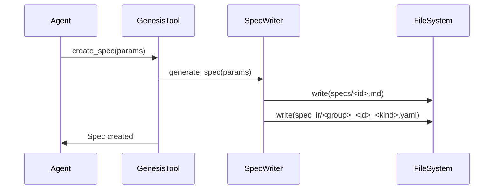

<spec>

# Genesis Spec Generation Logic

## Overview

Updates the `genesis_create_spec` tool to generate YAML IR files (`spec_ir/*.yaml`) alongside the standard markdown specs. This eliminates the need for agents to relay spec text to Aurora later.

## Requirements

### R1 - YAML Generation

```yaml
id: R1
priority: medium
status: draft
```

When a spec is created or updated, the system must generate a corresponding YAML SpecIR file in the `cclab/changes/<id>/spec_ir/` directory.

### R2 - File Naming

```yaml
id: R2
priority: medium
status: draft
```

YAML IR files must be named using the pattern `<group>_<id>_<kind>.yaml` to ensure uniqueness and traceability.

### R3 - Content Mapping

```yaml
id: R3
priority: medium
status: draft
```

The system must map the spec's diagrams and API definitions into the SpecIR struct structure before serialization to YAML.

## Acceptance Criteria

### Scenario: Create Spec (Happy Path)

- **WHEN** genesis_create_spec is called with valid parameters
- **THEN** Both the markdown spec file and the corresponding YAML IR file are created

### Scenario: Update Spec

- **WHEN** genesis_create_spec is called for an existing spec
- **THEN** The existing YAML IR file is overwritten with the new content

### Scenario: Multi-diagram Spec

- **WHEN** A spec with multiple diagrams is created
- **THEN** Multiple YAML IR files are generated, one for each diagram kind

## Diagrams

### Spec Creation Flow



</spec>
