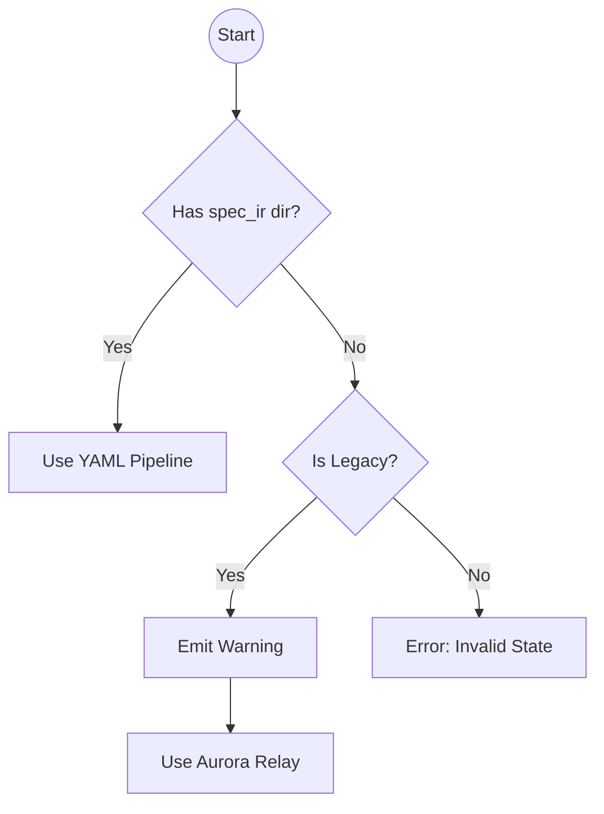

<spec>

# Migration Architecture & Compatibility Matrix

## Overview

Defines the migration strategy, compatibility matrix, and deprecation plan for moving from Aurora relay to YAML IR. Ensures dual-path support during transition and safe deprecation of legacy tools.

## Requirements

### R1 - Legacy Path Detection

```yaml
id: R1
priority: medium
status: draft
```

Identify if a change is using the legacy Aurora relay flow or the new YAML IR flow. New changes default to YAML IR. Legacy changes are detected by the absence of `spec_ir/` directory or explicit configuration.

### R2 - YAML Path Enforcement

```yaml
id: R2
priority: medium
status: draft
```

Enforce YAML IR flow for all new changes. Spec creation tools must generate YAML IR. Implementation tools must prefer YAML IR if present.

### R3 - Deprecation Warnings

```yaml
id: R3
priority: medium
status: draft
```

Emit deprecation warnings when legacy Aurora spec generation tools are used. Warning should include link to migration guide.

### R4 - Dual-Path Support

```yaml
id: R4
priority: medium
status: draft
```

Support both legacy and new flows simultaneously in the codebase, but scoped per-change. A single change cannot mix flows.

## Acceptance Criteria

### Scenario: Legacy Change Compatibility

- **WHEN** A change with no `spec_ir/` directory is processed
- **THEN** The system uses legacy Aurora relay pipeline and emits a deprecation warning

### Scenario: New Change Default

- **WHEN** A new change is created via genesis_create_spec
- **THEN** The system uses the new YAML IR pipeline

### Scenario: Mixed Flow Rejection

- **WHEN** A change attempts to use legacy tools while `spec_ir/` exists
- **THEN** The system returns an error stating mixing flows is not supported

## Diagrams

### Migration Logic Flow



</spec>
