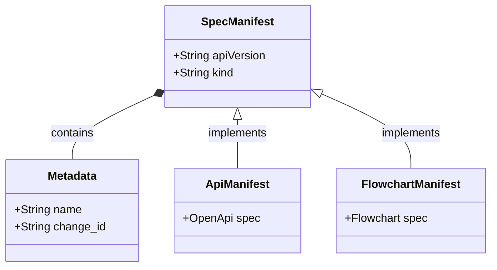

<spec>

# SpecIR YAML Manifest Schema

## Overview

Defines the YAML schema for SpecIR manifests, following a Kubernetes-style resource model (apiVersion, kind, metadata, spec). This serves as the language-agnostic interface between Genesis (producer) and Prism (consumer).

## Requirements

### R1 - Standard Envelope

```yaml
id: R1
priority: medium
status: draft
```

All SpecIR files must follow a standard envelope structure containing `apiVersion`, `kind`, `metadata`, and `spec` fields.

### R2 - Kind Registry

```yaml
id: R2
priority: medium
status: draft
```

The `kind` field identifies the type of spec payload (e.g., `Api`, `FlowchartPlus`, `SequencePlus`, `ClassPlus`). The `spec` field structure depends on the `kind`.

### R3 - Strict Serialization

```yaml
id: R3
priority: medium
status: draft
```

Manifests must be strictly serializable to/from YAML. Unknown fields should be rejected during validation to ensure strict contract adherence.

## Acceptance Criteria

### Scenario: Serialize API Spec

- **WHEN** An API spec is serialized
- **THEN** A valid YAML manifest with kind `Api` and OpenApi spec payload is produced

### Scenario: Deserialize Valid Manifest

- **WHEN** A valid YAML file is read
- **THEN** The manifest is successfully parsed into the corresponding Rust struct

### Scenario: Error on Missing Kind

- **WHEN** A YAML file missing the `kind` field is parsed
- **THEN** A validation error is returned stating `kind` is required

## Diagrams

### SpecIR Manifest Model



## API Specification (JSON Schema)

```yaml
$schema: http://json-schema.org/draft-07/schema#
properties:
  apiVersion:
    type: string
  kind:
    enum:
    - Api
    - FlowchartPlus
    - SequencePlus
    - ClassPlus
    - ErdPlus
    - RequirementPlus
    type: string
  metadata:
    properties:
      change_id:
        type: string
      name:
        type: string
      source_file:
        type: string
    required:
    - name
    - change_id
    type: object
  spec:
    type: object
required:
- apiVersion
- kind
- metadata
- spec
title: SpecManifest
type: object
```

</spec>
