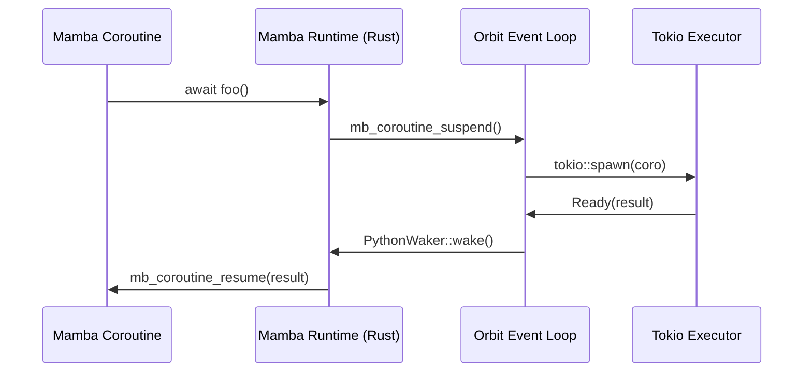

<spec>

# Async/Await and Coroutine Scheduling (#313)

## Overview

This specification defines the Mamba async/await runtime integration with the cclab-orbit bridge. It details how Mamba coroutines (state machines) are scheduled on the Orbit event loop, how GIL release is handled during awaits, and the interaction between the Mamba runtime and the underlying Tokio executor.

## Requirements

### R1 - Async Function Compilation

```yaml
id: R1
priority: high
status: draft
```

Compile async functions into state machine objects capable of suspension and resumption.

### R2 - Orbit Loop Integration

```yaml
id: R2
priority: high
status: draft
```

Integrate with the Orbit Event Loop to schedule coroutines and register wakers for I/O and timers.

### R3 - GIL-safe Scheduling

```yaml
id: R3
priority: high
status: draft
```

Ensure the GIL is released during coroutine suspension and re-acquired upon resumption when executing Mamba/Python code.

### R4 - Future Interoperability

```yaml
id: R4
priority: medium
status: draft
```

Provide a mechanism to await external futures (e.g., Tokio futures) within Mamba coroutines.

## Acceptance Criteria

### Scenario: Suspend and Resume Coroutine

- **GIVEN** An async function 'async def f(): await asyncio.sleep(1)'.
- **WHEN** The function is called and awaited.
- **THEN** The coroutine should suspend, allowing the loop to run other tasks, and resume after 1 second.

### Scenario: Concurrent Task Execution

- **GIVEN** Multiple async tasks spawned via asyncio.gather.
- **WHEN** The tasks are scheduled on the Orbit loop.
- **THEN** Tasks should execute concurrently on the underlying Tokio runtime.

## Diagrams

### Async Coroutine Execution Flow



</spec>
