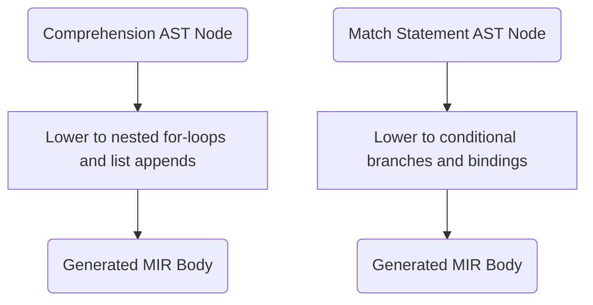

<spec>

# Comprehension, Generator, and Pattern Matching Codegen (#308, #309)

## Overview

This specification defines the lowering and code generation logic for Python-style comprehensions, generators, and pattern matching (match/case). It details how these high-level syntactic constructs are transformed into Middle-level IR (MIR) instructions involving loops, branches, and temporary variable bindings.

## Requirements

### R1 - Comprehension Lowering

```yaml
id: R1
priority: high
status: draft
```

Lower list, set, and dict comprehensions into equivalent nested for-loops and append/insert operations in MIR.

### R2 - Generator Expression Codegen

```yaml
id: R2
priority: high
status: draft
```

Compile generator expressions into state-machine based coroutine objects that yield values lazily.

### R3 - Pattern Matching Lowering

```yaml
id: R3
priority: high
status: draft
```

Lower match/case statements into efficient decision trees or switch-like branches in MIR, handling variable bindings and guards.

## Acceptance Criteria

### Scenario: Lower Comprehension to Loop

- **GIVEN** A list comprehension '[x*2 for x in items if x > 0]'.
- **WHEN** The comprehension is lowered to MIR.
- **THEN** The resulting MIR should contain a for-loop, a condition check, and a list append operation.

### Scenario: Lower Pattern Match to Branches

- **GIVEN** A match statement with literal and sequence patterns.
- **WHEN** The match statement is lowered.
- **THEN** The MIR should contain conditional jumps corresponding to the pattern structure.

## Diagrams

### Syntactic Feature Lowering Flow



</spec>
