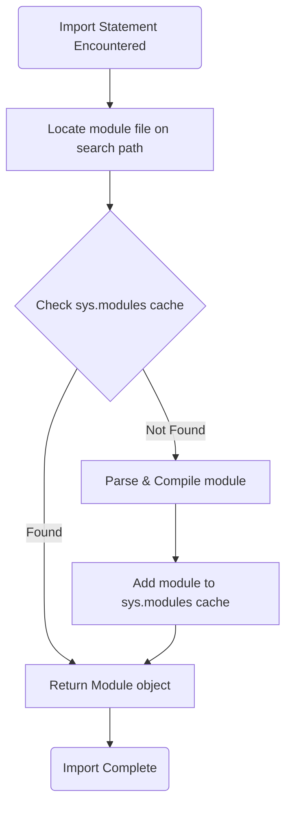

<spec>

# Multi-file Import System (#306)

## Overview

This specification defines the multi-file import system for Mamba. It covers module resolution, path searching, and the caching mechanism (`sys.modules`) to prevent redundant compilation and circular import handling.

## Requirements

### R1 - Module Path Resolution

```yaml
id: R1
priority: high
status: draft
```

Implement a mechanism to find module files based on a search path (PYTHONPATH equivalent).

### R2 - Module Caching

```yaml
id: R2
priority: high
status: draft
```

Use a global cache (sys.modules) to store and reuse already loaded module objects.

### R3 - Circular Import Handling

```yaml
id: R3
priority: high
status: draft
```

Properly handle circular imports by ensuring a module object is created and cached before its body is executed.

### R4 - Import Syntaxes

```yaml
id: R4
priority: high
status: draft
```

Support both `import module` and `from module import name` syntaxes.

## Acceptance Criteria

### Scenario: Successful Module Import

- **GIVEN** Two files a.py and b.py in the same directory.
- **WHEN** 'a.py' contains 'import b'.
- **THEN** Module 'b' should be available in 'a's namespace.

### Scenario: Circular Import Handling

- **GIVEN** Module 'a' imports 'b', and 'b' imports 'a'.
- **WHEN** The modules are imported.
- **THEN** Both modules should be loaded successfully without infinite recursion.

## Diagrams

### Module Import Flow



</spec>
