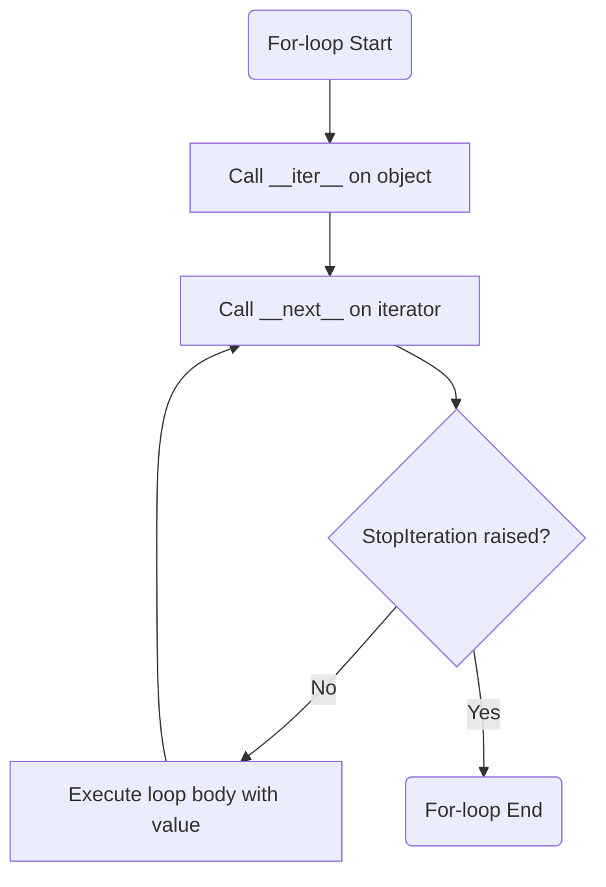

<spec>

# For-loop Iteration Protocol (#311)

## Overview

This specification defines the for-loop iteration protocol for Mamba, which matches the standard Python protocol involving __iter__ and __next__ methods. It includes the codegen for for-loops and the runtime handling of iterator objects and StopIteration exceptions.

## Requirements

### R1 - Obtain Iterator via __iter__

```yaml
id: R1
priority: high
status: draft
```

For-loops must call the `__iter__` method on the target object to obtain an iterator.

### R2 - Advance Iterator via __next__

```yaml
id: R2
priority: high
status: draft
```

The loop must repeatedly call `__next__` on the iterator until a `StopIteration` exception is raised.

### R3 - Built-in Iterators

```yaml
id: R3
priority: high
status: draft
```

Provide runtime support for built-in iterators for lists, dicts, and tuples.

## Acceptance Criteria

### Scenario: Iterate over List

- **GIVEN** A list [1, 2, 3].
- **WHEN** A for-loop iterates over the list.
- **THEN** The loop body should execute 3 times with values 1, 2, and 3.

### Scenario: Non-iterable Object Error

- **GIVEN** An object without an __iter__ method.
- **WHEN** A for-loop attempts to iterate over the object.
- **THEN** The runtime should raise a TypeError.

## Diagrams

### Iteration Protocol Flow



</spec>
