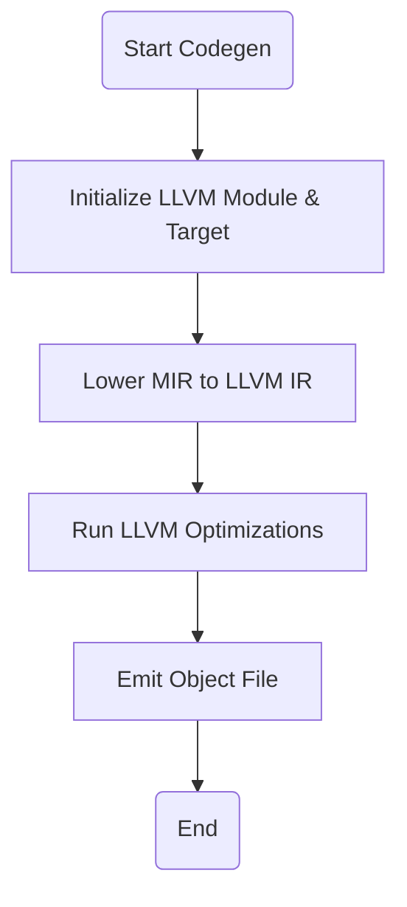

<spec>

# LLVM Backend for AOT Compilation (#305)

## Overview

This specification defines the integration of an LLVM backend into the Mamba compiler for Ahead-of-Time (AOT) compilation. It leverages the existing CodegenBackend trait to provide high-performance native code generation, supplementing the current Cranelift JIT implementation.

## Requirements

### R1 - LLVM Backend Initialization

```yaml
id: R1
priority: high
status: draft
```

Implement the CodegenBackend trait for LLVM, including module initialization and target machine setup.

### R2 - MIR to LLVM Lowering

```yaml
id: R2
priority: high
status: draft
```

Provide logic to lower Mamba Middle-level IR (MIR) to LLVM IR instructions.

### R3 - Object File Generation

```yaml
id: R3
priority: high
status: draft
```

Support compilation of MIR modules into standalone object files (ELF, Mach-O, COFF) using LLVM's target machine.

### R4 - Backend Selection Logic

```yaml
id: R4
priority: medium
status: draft
```

Allow the compiler driver to select between Cranelift JIT and LLVM AOT backends via configuration flags.

## Acceptance Criteria

### Scenario: Successful Object File Generation

- **GIVEN** A MIR module containing a 'hello world' function.
- **WHEN** The LLVM backend's codegen method is called with OutputType::ObjectFile.
- **THEN** The LLVM backend should produce a valid .o file for the target architecture.

### Scenario: LLVM Backend Selection

- **GIVEN** The compiler driver is configured with backend = 'llvm'.
- **WHEN** The compiler starts.
- **THEN** The driver should instantiate the LlvmBackend and use it for code generation.

### Scenario: Lowering Error Handling

- **GIVEN** An invalid MIR instruction.
- **WHEN** The lowering logic encounters an unsupported MIR node.
- **THEN** The LLVM backend should return an error indicating the lowering failure.

## Diagrams

### LLVM Codegen Flow



</spec>
