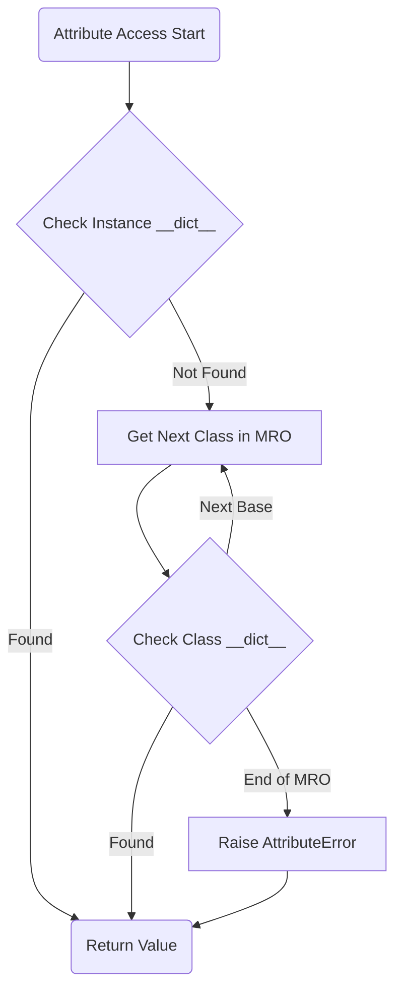

<spec>

# Complete OOP Model: Inheritance, super(), and Dunder Methods (#307)

## Overview

This specification defines the complete Object-Oriented Programming (OOP) model for Mamba, including single and multiple inheritance, the C3 Method Resolution Order (MRO), instance creation, and standard magic methods (dunder methods). It also covers the implementation of super() for dynamic method dispatch.

## Requirements

### R1 - C3 Method Resolution Order

```yaml
id: R1
priority: high
status: draft
```

Implement C3 linearization to compute a stable and consistent Method Resolution Order for all classes.

### R2 - super() Support

```yaml
id: R2
priority: high
status: draft
```

Provide a built-in `super()` function that correctly identifies the next class in the MRO relative to the current method's class and instance.

### R3 - Magic Method Dispatch (Operator Overloading)

```yaml
id: R3
priority: high
status: draft
```

Support operator overloading by dispatching binary and unary operations to the appropriate dunder methods (e.g., __add__, __neg__).

### R4 - Attribute Access Model

```yaml
id: R4
priority: high
status: draft
```

Manage class-level and instance-level attribute access via `__getattr__`, `__setattr__`, and `__delattr__` equivalent logic in the runtime.

## Acceptance Criteria

### Scenario: super() Dispatch

- **GIVEN** Class B inherits from Class A, both implementing 'speak'.
- **WHEN** B.speak() calls super().speak().
- **THEN** The result should be 'A's version of speak' concatenated with 'B's version'.

### Scenario: Operator Overloading Dispatch

- **GIVEN** An instance X of Class C with __add__ implemented.
- **WHEN** X + 5 is executed.
- **THEN** The __add__ method of C should be called.

## Diagrams

### OOP Attribute Lookup (MRO) Flow



</spec>
