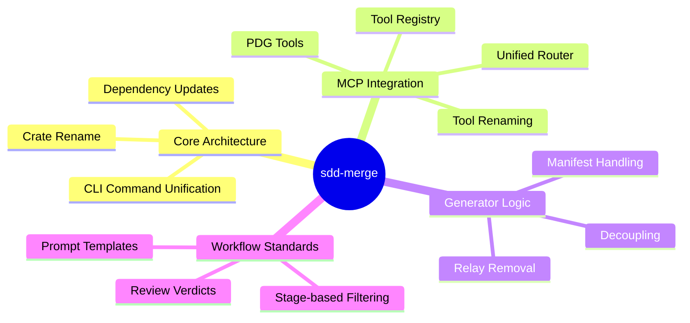

<proposal>

# Spec Navigation Map: sdd-merge

## Scope Overview (Mindmap)

## Spec Dependency Graph (Block Diagram)

```mermaid
block-beta
  columns 3

  crate_unification["crate-unification\n codebase: G3: Unimplemented Crate Unification, G5: Aurora Relay Removal\n gaps: codebase_spec#3, codebase_spec#5"]
  mcp_router_unification["mcp-router-unification\n codebase: G1: Redundant Registry Implementations, G2: Missing PDG Tools in Unified Router, G4: Duplicate HTTP Server Logic, G6: Redundant CLI Server Commands\n gaps: codebase_spec#1, codebase_spec#2, codebase_spec#4, codebase_spec#6, spec_knowledge#3"]
  generator_decoupling["generator-decoupling\n codebase: G5: Aurora Relay Removal\n gaps: spec_knowledge#2"]
  manifest_handling["manifest-handling\n gaps: spec_knowledge#1"]
  review_verdict_unification["review-verdict-unification\n gaps: spec_knowledge#4"]
  prompt_template_update["prompt-template-update\n gaps: spec_knowledge#5"]

  crate_unification --> mcp_router_unification
  mcp_router_unification --> generator_decoupling
  crate_unification --> manifest_handling
  crate_unification --> review_verdict_unification
  crate_unification --> prompt_template_update
```

## Spec Execution Order

1. **crate-unification** — Crate Unification and Rename
   - code: crates/cclab-genesis, crates/cclab-aurora, Cargo.toml
2. **manifest-handling** — Manifest Handling in Merge Logic
   - depends: crate-unification
   - code: crates/cclab-sdd/src/cli/archive.rs
3. **mcp-router-unification** — Unified MCP Router and Registry
   - depends: crate-unification
   - code: crates/cclab-server/src/mcp, crates/cclab-sdd/src/mcp
4. **generator-decoupling** — Generator Decoupling and Legacy Removal
   - depends: mcp-router-unification
   - code: crates/cclab-sdd/src/fillback, crates/cclab-sdd/src/mcp/tools
5. **prompt-template-update** — Prompt Template Updates
   - depends: crate-unification
   - code: crates/cclab-sdd/src/orchestrator/prompts.rs, docs/PROMPT_TEMPLATE_INTEGRATION.md
6. **review-verdict-unification** — Unified Review Verdicts
   - depends: crate-unification
   - code: crates/cclab-sdd/src/models/review.rs

</proposal>
