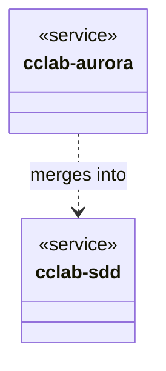

<spec>

# Crate Unification and Rename

## Overview

This spec covers the renaming of `cclab-genesis` to `cclab-sdd` and the merging of `cclab-aurora` functionality into the new crate. This aligns the crate structure with the unified SDD vision and removes the separate Aurora generator crate. All workspace dependencies will be updated to point to `cclab-sdd`.

## Requirements

### R1 - Rename Genesis Crate

```yaml
id: R1
priority: medium
status: draft
```

Rename the `cclab-genesis` crate to `cclab-sdd` in `Cargo.toml` and directory structure.

### R2 - Merge Aurora Code

```yaml
id: R2
priority: medium
status: draft
```

Move all source code from `cclab-aurora` into `cclab-sdd/src/mcp/tools/aurora` (initially) or appropriate modules.

### R3 - Remove Aurora Crate

```yaml
id: R3
priority: medium
status: draft
```

Remove the `cclab-aurora` crate from the workspace and file system.

### R4 - Update Workspace Dependencies

```yaml
id: R4
priority: medium
status: draft
```

Update all internal crate dependencies in the workspace to replace `cclab-genesis` and `cclab-aurora` with `cclab-sdd`.

## Acceptance Criteria

### Scenario: Build Workspace

- **WHEN** running `cargo build --workspace`
- **THEN** the build should succeed without errors

### Scenario: Check Aurora Tools

- **WHEN** inspecting the `cclab-sdd` library symbols
- **THEN** the tools should be available under the `cclab-sdd` crate

## Diagrams

### Crate Unification



</spec>
