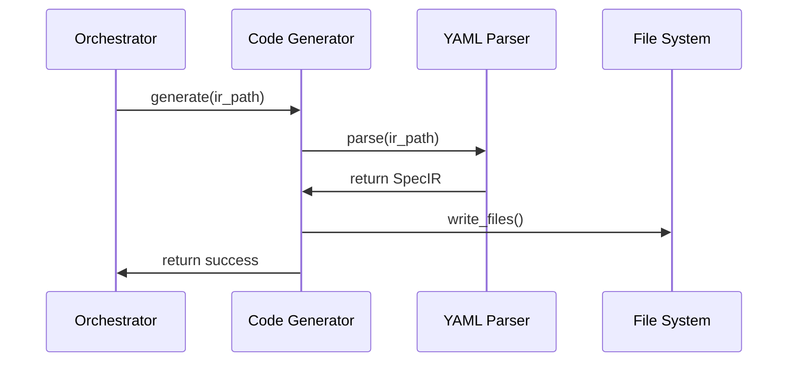

<spec>

# Generator Decoupling and Legacy Removal

## Overview

This spec enforces the 'Agnostic SpecIR pipeline' pattern by refactoring merged Aurora generators to consume YAML IR directly, removing the legacy `call_aurora_tool` relay logic. This ensures decoupling from the prompt/LLM layer and improves testability.

## Requirements

### R1 - Direct IR Consumption

```yaml
id: R1
priority: medium
status: draft
```

Refactor all generators to accept parsed `SpecIR` structs (from YAML) instead of raw JSON/LLM output.

### R2 - Remove Relay Logic

```yaml
id: R2
priority: medium
status: draft
```

Remove the `call_aurora_tool` function and related relay infrastructure that routed calls to the external Aurora crate.

### R3 - IR Validation

```yaml
id: R3
priority: medium
status: draft
```

Implement strict validation for input YAML IR before generation proceeds.

### R4 - Update Tests

```yaml
id: R4
priority: medium
status: draft
```

Update unit tests to use static YAML fixtures instead of mocked tool calls.

## Acceptance Criteria

### Scenario: Generate from YAML

- **WHEN** invoking a generator with a valid YAML IR file
- **THEN** the corresponding code files are written to disk without invoking external tools

### Scenario: Handle Invalid IR

- **WHEN** invoking a generator with malformed YAML
- **THEN** a validation error is returned gracefully

## Diagrams

### Decoupled Generation Flow



</spec>
