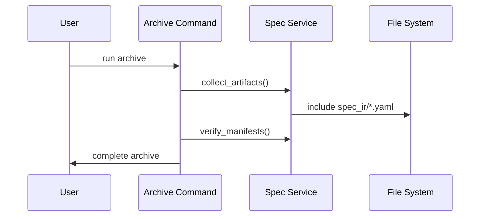

<spec>

# Manifest Handling in Merge Logic

## Overview

This spec updates the change archiving and merging logic to explicitly handle `spec_ir/*.yaml` manifests. This ensures that the intermediate representation of specs is preserved and synchronized along with the markdown specifications, maintaining a complete source of truth.

## Requirements

### R1 - Include Spec IR in Archive

```yaml
id: R1
priority: medium
status: draft
```

Update the archive command to identify and copy `spec_ir` directories and their contents.

### R2 - Validate IR Manifests

```yaml
id: R2
priority: medium
status: draft
```

Implement validation steps to ensure all referenced `spec_ir` files exist and are valid YAML before allowing archive.

### R3 - Sync IR on Merge

```yaml
id: R3
priority: medium
status: draft
```

Ensure that `spec_ir` files are correctly moved to the permanent spec registry during the merge phase.

## Acceptance Criteria

### Scenario: Archive with IR

- **WHEN** archiving a change that includes generated YAML specs
- **THEN** the `spec_ir` folder is present in the archive directory

### Scenario: Merge Verification

- **WHEN** verifying a change with complete manifests
- **THEN** the merge check passes if all IR files are valid

## Diagrams

### Archive Flow with Manifests



</spec>
