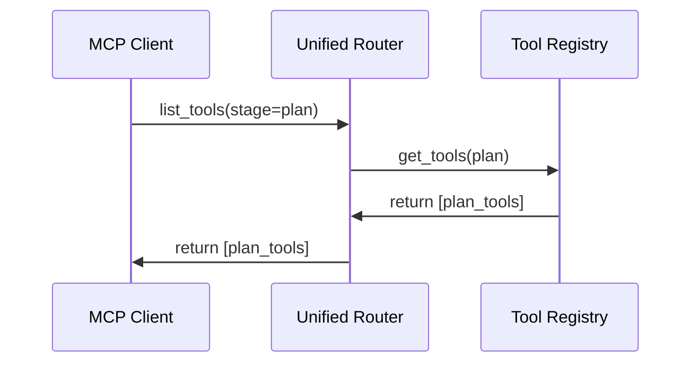

<spec>

# Unified MCP Router and Registry

## Overview

This spec defines the unified MCP router and registry logic within `cclab-sdd`. It consolidates duplicate implementations from `cclab-server` and `cclab-genesis`, adds missing PDG tools, and implements stage-based tool filtering (Plan, Implement, Archive) to optimize LLM context. `cclab-server` will become a thin consumer of this logic.

## Requirements

### R1 - Unified Router Implementation

```yaml
id: R1
priority: medium
status: draft
```

Implement `UnifiedMcpRouter` in `cclab-sdd` that handles request routing and tool dispatch.

### R2 - Add PDG Tools

```yaml
id: R2
priority: medium
status: draft
```

Integrate `prism_pdg` tools into the unified router to expose program dependence graph capabilities.

### R3 - Unify Registry Logic

```yaml
id: R3
priority: medium
status: draft
```

Port and unify tool registry logic into `cclab-sdd`, ensuring a single source of truth for tool definitions.

### R4 - Stage-based Filtering

```yaml
id: R4
priority: medium
status: draft
```

Implement stage-based tool filtering to expose only relevant tools for the current workflow phase (e.g., plan, implement).

### R5 - Refactor Server Consumer

```yaml
id: R5
priority: medium
status: draft
```

Refactor `cclab-server` to use the `cclab-sdd` router/registry, removing its local duplicate implementation.

## Acceptance Criteria

### Scenario: List Plan Tools

- **WHEN** requesting tools with stage='plan'
- **THEN** only planning-related tools are returned

### Scenario: Access PDG Tool

- **WHEN** calling `prism_pdg` via the unified router
- **THEN** the tool executes successfully and returns graph data

### Scenario: Server Startup

- **WHEN** starting the `cclab-server` instance
- **THEN** the registry is initialized with all core and merged tools

## Diagrams

### Tool Listing Flow



</spec>
