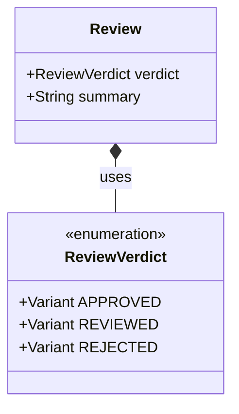

<spec>

# Unified Review Verdicts

## Overview

This spec standardizes the review verdict logic across the unified crate by introducing a strict `ReviewVerdict` enum (APPROVED, REVIEWED, REJECTED). This aligns with the knowledge base standards and ensures consistent automated handling of review outcomes.

## Requirements

### R1 - Define Verdict Enum

```yaml
id: R1
priority: medium
status: draft
```

Define a public `ReviewVerdict` enum with variants `Approved`, `Reviewed`, and `Rejected`.

### R2 - Update Review Model

```yaml
id: R2
priority: medium
status: draft
```

Update the `Review` model to use the `ReviewVerdict` enum instead of raw strings.

### R3 - Backward Compatibility

```yaml
id: R3
priority: medium
status: draft
```

Implement deserialization logic to map legacy string verdicts (e.g., 'PASS', 'FAIL') to the new enum variants for backward compatibility.

## Acceptance Criteria

### Scenario: Parse Approved Verdict

- **WHEN** parsing a review file with `verdict: APPROVED`
- **THEN** it is deserialized as `ReviewVerdict::Approved`

### Scenario: Parse Legacy Pass

- **WHEN** parsing a review file with `verdict: PASS`
- **THEN** it is deserialized as `ReviewVerdict::Approved`

## Diagrams

### Review Verdict Model



</spec>
