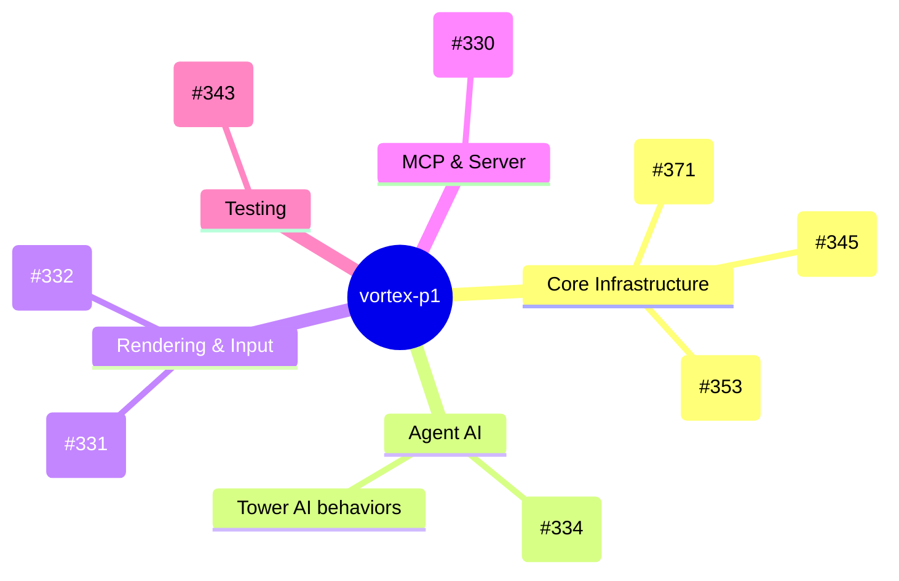

<proposal>

# Spec Navigation Map: vortex-p1

## Scope Overview (Mindmap)

## Spec Dependency Graph (Block Diagram)

```mermaid
block-beta
  columns 3

  event_bus["event-bus\n codebase: core/event.rs — EventBus, TypedEventQueue\n gaps: codebase_spec#1, codebase_knowledge#4"]
  game_state_machine["game-state-machine\n codebase: core/state.rs — GamePhase, GameStateMachine\n gaps: codebase_spec#4, spec_knowledge#4"]
  render_game_loop["render-game-loop\n codebase: core/app.rs — App, ApplicationHandler, render/context.rs — RenderContext, render/layers.rs — RenderQueue\n gaps: codebase_spec#6"]
  player_interaction["player-interaction\n codebase: core/input.rs — Input, render/ui.rs — UI rendering, td/tower.rs — tower placement\n gaps: codebase_spec#3"]
  agent_tower_ai["agent-tower-ai\n codebase: agent/behavior_tree.rs — BtNode, BtAction, agent/state_machine.rs — StateMachine<S>\n gaps: codebase_spec#5, spec_knowledge#6"]
  debug_overlay["debug-overlay\n codebase: render/text.rs — TextRenderer, render/layers.rs — RenderLayer::Debug"]
  mcp_server_integration["mcp-server-integration\n codebase: mcp/tools.rs — VortexTool, cclab-server/mcp/router.rs — UnifiedMcpRouter\n gaps: codebase_spec#2, codebase_knowledge#1"]
  td_integration_tests["td-integration-tests\n codebase: td/ — tower, wave, enemy, economy modules"]

  event_bus --> game_state_machine
  event_bus --> render_game_loop
  game_state_machine --> render_game_loop
  event_bus --> player_interaction
  render_game_loop --> player_interaction
  event_bus --> agent_tower_ai
  event_bus --> debug_overlay
  render_game_loop --> debug_overlay
  event_bus --> mcp_server_integration
  event_bus --> td_integration_tests
  game_state_machine --> td_integration_tests
  agent_tower_ai --> td_integration_tests
  player_interaction --> td_integration_tests
```

## Spec Execution Order

1. **event-bus** — Type-safe Event Bus with Sync+Async Support (#345)
   - code: crates/cclab-vortex/src/core/event.rs
2. **agent-tower-ai** — Agent-driven Tower AI with BT+FSM Dual Architecture (#334)
   - depends: event-bus
   - code: crates/cclab-vortex/src/agent/behavior_tree.rs, crates/cclab-vortex/src/agent/state_machine.rs, crates/cclab-vortex/src/agent/decision.rs, crates/cclab-vortex/src/td/tower.rs
3. **game-state-machine** — Extended Game State Machine (#371) — Loading/LevelSelect/Playing/Paused/GameOver/Victory
   - depends: event-bus
   - code: crates/cclab-vortex/src/core/state.rs
4. **mcp-server-integration** — Integrate Vortex MCP Tools into cclab-server Router (#330)
   - depends: event-bus
   - code: crates/cclab-vortex/src/mcp/tools.rs, crates/cclab-vortex/src/mcp/state_reader.rs, crates/cclab-server/src/mcp/router.rs
5. **render-game-loop** — Renderer Integration into Game Loop (#331)
   - depends: event-bus, game-state-machine
   - code: crates/cclab-vortex/src/core/app.rs, crates/cclab-vortex/src/render/context.rs, crates/cclab-vortex/src/render/layers.rs
6. **debug-overlay** — Debug Overlay — FPS, Entity Count, System Timings (#353)
   - depends: event-bus, render-game-loop
   - code: crates/cclab-vortex/src/render/text.rs, crates/cclab-vortex/src/render/layers.rs
7. **player-interaction** — Mouse Click Tower Placement + UI Tower Selection Panel (#332)
   - depends: event-bus, render-game-loop
   - code: crates/cclab-vortex/src/core/input.rs, crates/cclab-vortex/src/render/ui.rs, crates/cclab-vortex/src/td/tower.rs
8. **td-integration-tests** — TD Gameplay Integration Tests (#343)
   - depends: event-bus, game-state-machine, agent-tower-ai, player-interaction
   - code: crates/cclab-vortex/tests/

</proposal>
