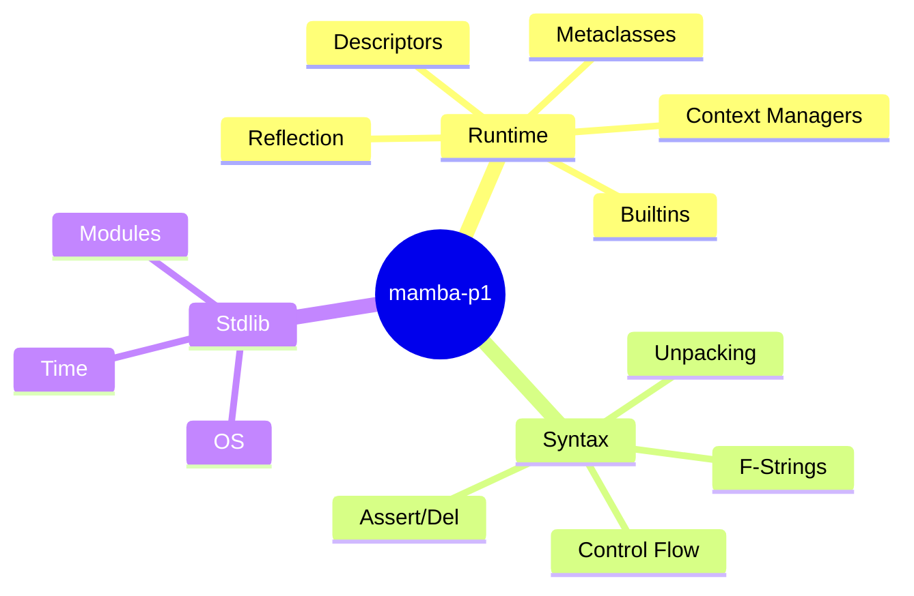
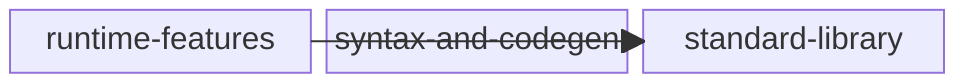

<proposal>

# Spec Navigation Map: mamba-p1

## Scope Overview (Mindmap)

## Spec Dependency Graph (Block Diagram)

## Spec Execution Order

1. **runtime-features** — Mamba Runtime Features (Descriptors, Metaclasses, Builtins)
   - code: crates/mamba/src/runtime/
2. **standard-library** — Mamba Standard Library Implementation
   - depends: runtime-features
   - code: crates/mamba/src/resolve/, crates/mamba/src/runtime/modules/
3. **syntax-and-codegen** — Mamba Syntax and Codegen Enhancements
   - code: crates/mamba/src/codegen/, crates/mamba/src/parser/

</proposal>
