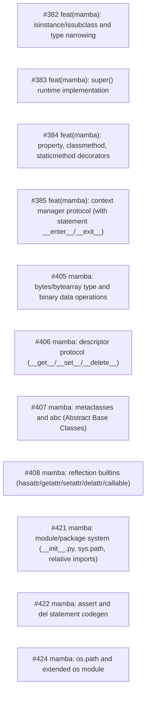

# Context Clarifications

## Q1: General
- **Question**: What is the scope?
- **Answer**: All remaining P1 mamba issues: #382 isinstance/issubclass, #383 super(), #384 property/classmethod/staticmethod, #385 context manager, #405 bytes/bytearray, #406 descriptor protocol, #407 metaclasses/abc, #408 reflection builtins, #421 module system, #422 assert/del codegen, #424 os module
- **Rationale**: 

## Q2: General
- **Question**: Git workflow?
- **Answer**: in_place on current sdd-and-mamba branch
- **Rationale**: 

## Q3: General
- **Question**: Affected modules?
- **Answer**: crates/cclab-mamba — parser, AST, HIR, MIR, runtime, stdlib
- **Rationale**: 

## Dependency Graph

| Order | Issue | Depends On |
|-------|-------|------------|
| 1 | #382 — feat(mamba): isinstance/issubclass and type narrowing | — |
| 2 | #383 — feat(mamba): super() runtime implementation | — |
| 3 | #384 — feat(mamba): property, classmethod, staticmethod decorators | — |
| 4 | #385 — feat(mamba): context manager protocol (with statement __enter__/__exit__) | — |
| 5 | #405 — mamba: bytes/bytearray type and binary data operations | — |
| 6 | #406 — mamba: descriptor protocol (__get__/__set__/__delete__) | — |
| 7 | #407 — mamba: metaclasses and abc (Abstract Base Classes) | — |
| 8 | #408 — mamba: reflection builtins (hasattr/getattr/setattr/delattr/callable) | — |
| 9 | #421 — mamba: module/package system (__init__.py, sys.path, relative imports) | — |
| 10 | #422 — mamba: assert and del statement codegen | — |
| 11 | #424 — mamba: os.path and extended os module | — |

