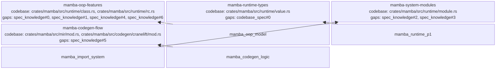

<proposal>

# Spec Navigation Map: mamba-p1b

## Scope Overview (Mindmap)

```mermaid
mindmap
  root((mamba-p1b))  
    OOP Features
      super()
      descriptors
      decorators
      metaclasses
      reflection
      isinstance
    Runtime Types
      bytes
      bytearray
    System Integration
      Modules
      Packages
      os module
    Control Flow
      with statement
      assert
      del
```

## Spec Dependency Graph (Block Diagram)



## Spec Execution Order

1. **mamba-codegen-flow** — Control Flow Codegen
   - depends: mamba-codegen-logic
   - code: crates/mamba/src/mir/mod.rs, crates/mamba/src/codegen/cranelift/mod.rs
2. **mamba-oop-features** — Advanced OOP Features
   - depends: mamba-oop-model
   - code: crates/mamba/src/runtime/class.rs, crates/mamba/src/runtime/symbols.rs
3. **mamba-runtime-types** — Runtime Types (Bytes)
   - depends: mamba-runtime-p1
   - code: crates/mamba/src/runtime/value.rs, crates/mamba/src/runtime/object.rs
4. **mamba-system-modules** — System Modules & Integration
   - depends: mamba-import-system
   - code: crates/mamba/src/runtime/module.rs, crates/mamba/src/stdlib/os.rs

</proposal>
