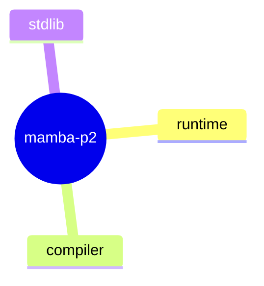

<proposal>

# Spec Navigation Map: mamba-p2

## Scope Overview (Mindmap)

## Spec Dependency Graph (Block Diagram)

## Spec Execution Order

1. **builtin-types** — Built-in Types (bytes, bytearray, frozenset)
   - code: crates/mamba/src/runtime/rc.rs
2. **runtime-features** — Runtime Features (Context Managers, Unpacking, etc.)
   - code: crates/mamba/src/compiler/, crates/mamba/src/runtime/
3. **stdlib-modules** — Standard Library Modules Implementation
   - code: crates/mamba/src/runtime/stdlib/

</proposal>
