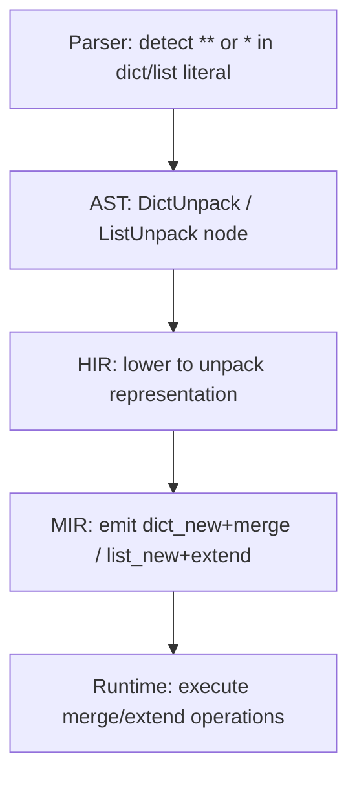

<spec>

# Runtime core P2: unpacking, __format__, __del__, except*, __slots__

## Overview

Core runtime enhancements for Mamba P2 covering five features: dict/list unpacking expressions ({**d1, **d2}, [*a, *b]) requiring parser and codegen changes, __format__ protocol with f-string debug syntax (f"{x=}"), __del__ finalizer integration with GC, exception groups (PEP 654) with except* syntax, and __slots__ support for memory-efficient classes.

## Requirements

### R1 - Dict unpacking expressions

```yaml
id: R1
priority: high
status: draft
```

Parse {**d1, **d2, key: val} as DictUnpack AST nodes in expr.rs. Lower to HIR DictUnpack node. In MIR lowering, emit mb_dict_new() then mb_dict_merge() for each **expr, mb_dict_setitem() for literal keys.

### R2 - List unpacking expressions

```yaml
id: R2
priority: high
status: draft
```

Parse [*a, *b, val] as ListUnpack AST nodes in expr.rs. Lower to HIR ListUnpack node. In MIR lowering, emit mb_list_new() then mb_list_extend() for each *expr, mb_list_append() for literals.

### R3 - __format__ protocol dispatch

```yaml
id: R3
priority: medium
status: draft
```

Add mb_obj_format(obj, spec) in class.rs. Looks up __format__ dunder on obj's class; if found, calls it with spec string. Falls back to mb_obj_str() if not defined. Register in symbols.rs.

### R4 - F-string debug syntax f'{x=}'

```yaml
id: R4
priority: medium
status: draft
```

Parse f'{x=}' in expr.rs as FStringDebug node containing the expression and its source text. Lower to string concatenation: 'x=' + repr(x). Extend hir_to_mir.rs fstring lowering.

### R5 - __del__ finalizer in GC

```yaml
id: R5
priority: medium
status: draft
```

Add optional destructor flag to MbClass. During GC sweep in gc.rs, before freeing an instance with __del__, call the destructor. If __del__ re-references the object (resurrection), skip collection for this cycle.

### R6 - ExceptionGroup class

```yaml
id: R6
priority: high
status: draft
```

Add ExceptionGroup to exception.rs wrapping Vec<MbValue> of sub-exceptions. Methods: mb_exception_group_new(message, exceptions), mb_exception_group_split(group, predicate), mb_exception_group_subgroup(group, predicate), mb_exception_group_exceptions(group).

### R7 - except* syntax parsing and lowering

```yaml
id: R7
priority: high
status: draft
```

Add ExceptStar variant to AST in ast.rs. Parse 'except* Type as e:' in stmt_compound.rs. Lower to HIR/MIR with multi-handler matching that splits ExceptionGroup by type.

### R8 - __slots__ support

```yaml
id: R8
priority: medium
status: draft
```

Add optional slots: Vec<String> to MbClass in class.rs. During class creation, if __slots__ is defined, store the list. In mb_setattr, if class has slots, reject attribute names not in the list.

## Acceptance Criteria

### Scenario: Dict unpacking merges two dicts

- **GIVEN** d1 = {'a': 1}, d2 = {'b': 2}
- **WHEN** result = {**d1, **d2}
- **THEN** result == {'a': 1, 'b': 2}

### Scenario: List unpacking concatenates

- **GIVEN** a = [1, 2], b = [3, 4]
- **WHEN** result = [*a, *b]
- **THEN** result == [1, 2, 3, 4]

### Scenario: F-string debug shows name=value

- **WHEN** x = 42; s = f'{x=}'
- **THEN** s == 'x=42'

### Scenario: except* catches matching exceptions

- **WHEN** ExceptionGroup raised with [ValueError, TypeError], except* ValueError handler
- **THEN** Handler catches ValueError, remaining TypeError propagates

### Scenario: __slots__ restricts attributes

- **GIVEN** class Foo with __slots__ = ['x', 'y']
- **WHEN** foo.z = 1
- **THEN** AttributeError raised

## Diagrams

### Dict/List Unpacking Pipeline



</spec>
