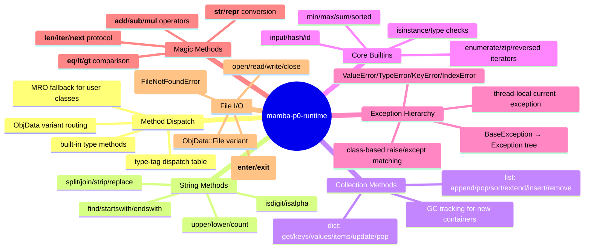
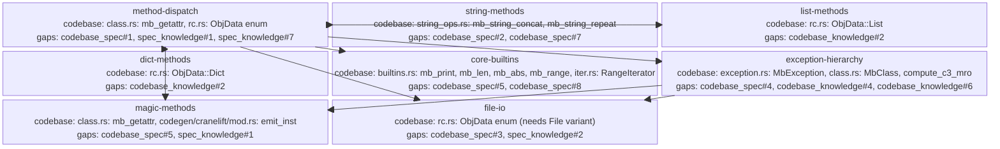

<proposal>

# Spec Navigation Map: mamba-p0-runtime

## Scope Overview (Mindmap)

## Spec Dependency Graph (Block Diagram)

## Spec Execution Order

1. **method-dispatch** — Type-Tagged Method Dispatch for Built-in Types
   - code: crates/mamba/src/runtime/class.rs, crates/mamba/src/runtime/rc.rs, crates/mamba/src/lower/hir_to_mir.rs, crates/mamba/src/runtime/symbols.rs
2. **core-builtins** — Core Built-in Functions (enumerate, zip, min, max, sum, sorted, isinstance, input)
   - depends: method-dispatch
   - code: crates/mamba/src/runtime/builtins.rs, crates/mamba/src/runtime/iter.rs, crates/mamba/src/runtime/symbols.rs
3. **dict-methods** — Dict Method Implementations (get, keys, values, items, update, etc.)
   - depends: method-dispatch
   - code: crates/mamba/src/runtime/dict_ops.rs, crates/mamba/src/runtime/symbols.rs, crates/mamba/src/runtime/mod.rs
4. **exception-hierarchy** — Class-Based Exception Hierarchy (BaseException → Exception → ValueError, TypeError, etc.)
   - depends: method-dispatch
   - code: crates/mamba/src/runtime/exception.rs, crates/mamba/src/runtime/rc.rs, crates/mamba/src/runtime/class.rs, crates/mamba/src/runtime/symbols.rs
5. **file-io** — File I/O Runtime (open, read, write, close with ObjData::File)
   - depends: method-dispatch, exception-hierarchy
   - code: crates/mamba/src/runtime/file_io.rs, crates/mamba/src/runtime/rc.rs, crates/mamba/src/runtime/mod.rs, crates/mamba/src/runtime/symbols.rs
6. **list-methods** — List Method Implementations (append, pop, sort, extend, etc.)
   - depends: method-dispatch
   - code: crates/mamba/src/runtime/list_ops.rs, crates/mamba/src/runtime/symbols.rs, crates/mamba/src/runtime/mod.rs
7. **magic-methods** — Magic Method Dispatch (__add__, __str__, __eq__, __len__, __iter__, __next__)
   - depends: method-dispatch, exception-hierarchy
   - code: crates/mamba/src/runtime/class.rs, crates/mamba/src/lower/hir_to_mir.rs, crates/mamba/src/codegen/cranelift/mod.rs, crates/mamba/src/codegen/cranelift/jit.rs, crates/mamba/src/runtime/symbols.rs
8. **string-methods** — String Method Implementations (split, join, strip, replace, etc.)
   - depends: method-dispatch
   - code: crates/mamba/src/runtime/string_ops.rs, crates/mamba/src/runtime/symbols.rs

</proposal>
