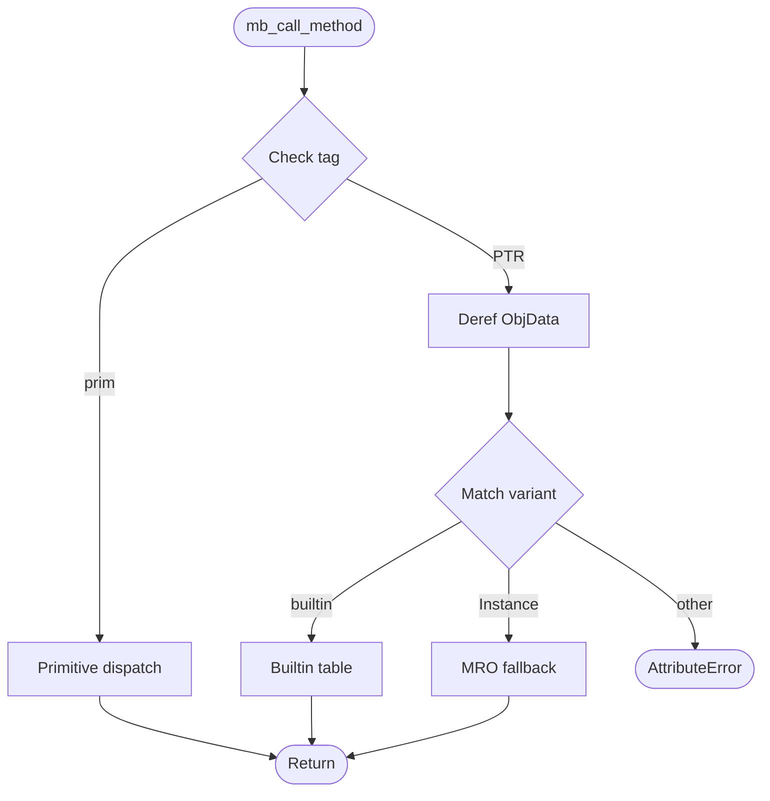

<spec>

# Type-Tagged Method Dispatch for Built-in Types

## Overview

Implements a type-tagged method dispatch mechanism for built-in types (str, list, dict, int, float, bool). When a method call like x.split() is encountered, the runtime extracts the ObjData tag from the receiver, looks up the method name in a dispatch table, and calls the corresponding Rust runtime function. For user-defined classes, falls back to MRO-based attribute lookup. This is the foundation for all P0 method implementations.

## Requirements

### R1 - Dispatch table for built-in types

```yaml
id: R1
priority: high
status: draft
```

Create mb_call_method(receiver: i64, method_name: i64, args: *const i64, argc: i64) -> i64 that extracts ObjData variant, matches (variant, method_name_str), calls target runtime function, returns i64. Raises AttributeError for unknown methods.

### R2 - Primitive type dispatch

```yaml
id: R2
priority: high
status: draft
```

For NaN-boxed primitives (TAG_INT, TAG_BOOL, TAG_NONE), dispatch methods without heap allocation.

### R3 - MRO fallback for user classes

```yaml
id: R3
priority: high
status: draft
```

When receiver is ObjData::Instance, fall back to MRO-based attribute lookup.

### R4 - Symbol registration

```yaml
id: R4
priority: high
status: draft
```

Register mb_call_method in symbols.rs as MirExtern for JIT/AOT.

## Acceptance Criteria

### Scenario: String method dispatch

- **WHEN** s.split(' ') called on string
- **THEN** Routes to mb_string_split

### Scenario: Primitive dispatch

- **WHEN** str(42) invokes __str__ on int
- **THEN** Handles TAG_INT without heap lookup

### Scenario: MRO fallback

- **WHEN** Foo().bar() on user class
- **THEN** Falls back to MRO

### Scenario: AttributeError

- **WHEN** 42.nonexistent() called
- **THEN** Raises AttributeError

## Diagrams

### Dispatch Flow



</spec>
