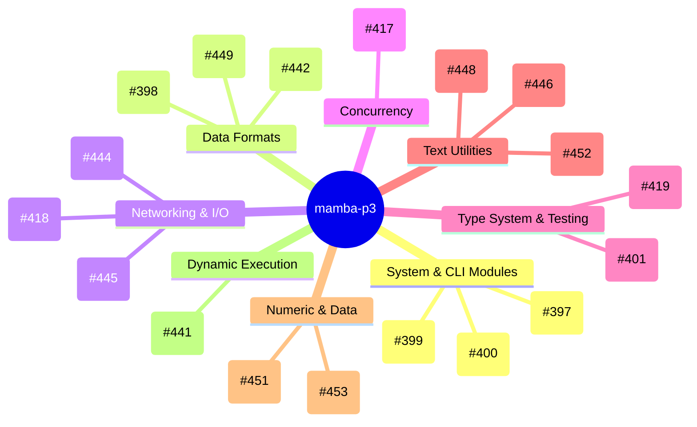
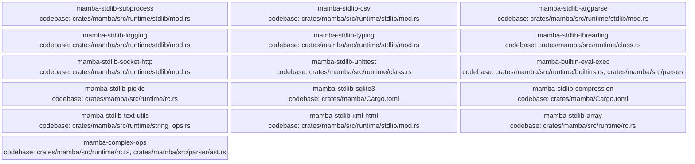

<proposal>

# Spec Navigation Map: mamba-p3

## Scope Overview (Mindmap)

## Spec Dependency Graph (Block Diagram)

## Spec Execution Order

1. **mamba-builtin-eval-exec** — eval/exec/compile/globals/locals builtins
   - code: crates/mamba/src/runtime/builtins.rs, crates/mamba/src/runtime/symbols.rs
2. **mamba-complex-ops** — Complex number full operations and cmath module
   - code: crates/mamba/src/runtime/rc.rs, crates/mamba/src/runtime/string_ops.rs, crates/mamba/src/runtime/class.rs, crates/mamba/src/runtime/gc.rs, crates/mamba/src/runtime/builtins.rs, crates/mamba/src/runtime/stdlib/cmath_mod.rs, crates/mamba/src/runtime/stdlib/mod.rs
3. **mamba-stdlib-argparse** — argparse module — CLI argument parsing
   - code: crates/mamba/src/runtime/stdlib/argparse_mod.rs, crates/mamba/src/runtime/stdlib/mod.rs
4. **mamba-stdlib-array** — array module — efficient typed arrays
   - code: crates/mamba/src/runtime/stdlib/array_mod.rs, crates/mamba/src/runtime/stdlib/mod.rs
5. **mamba-stdlib-compression** — gzip, zipfile, tarfile modules — compression/archives
   - code: crates/mamba/src/runtime/stdlib/gzip_mod.rs, crates/mamba/src/runtime/stdlib/zipfile_mod.rs, crates/mamba/src/runtime/stdlib/tarfile_mod.rs, crates/mamba/src/runtime/stdlib/mod.rs, crates/mamba/Cargo.toml
6. **mamba-stdlib-csv** — csv module — CSV file reading/writing
   - code: crates/mamba/src/runtime/stdlib/csv_mod.rs, crates/mamba/src/runtime/stdlib/mod.rs
7. **mamba-stdlib-logging** — logging module — structured log output
   - code: crates/mamba/src/runtime/stdlib/logging_mod.rs, crates/mamba/src/runtime/stdlib/mod.rs
8. **mamba-stdlib-pickle** — pickle module — object serialization
   - code: crates/mamba/src/runtime/stdlib/pickle_mod.rs, crates/mamba/src/runtime/stdlib/mod.rs
9. **mamba-stdlib-socket-http** — socket and http/urllib modules — networking
   - code: crates/mamba/src/runtime/stdlib/socket_mod.rs, crates/mamba/src/runtime/stdlib/http_mod.rs, crates/mamba/src/runtime/stdlib/mod.rs
10. **mamba-stdlib-sqlite3** — sqlite3 module — database interface
   - code: crates/mamba/src/runtime/stdlib/sqlite3_mod.rs, crates/mamba/src/runtime/stdlib/mod.rs, crates/mamba/Cargo.toml
11. **mamba-stdlib-subprocess** — subprocess module — external command execution
   - code: crates/mamba/src/runtime/stdlib/subprocess_mod.rs, crates/mamba/src/runtime/stdlib/mod.rs, crates/mamba/src/runtime/symbols.rs
12. **mamba-stdlib-text-utils** — pprint, textwrap, string modules — text utilities
   - code: crates/mamba/src/runtime/stdlib/pprint_mod.rs, crates/mamba/src/runtime/stdlib/textwrap_mod.rs, crates/mamba/src/runtime/stdlib/string_constants_mod.rs, crates/mamba/src/runtime/stdlib/mod.rs
13. **mamba-stdlib-threading** — threading module — Thread, Lock, Event
   - code: crates/mamba/src/runtime/stdlib/threading_mod.rs, crates/mamba/src/runtime/stdlib/mod.rs
14. **mamba-stdlib-typing** — typing module — runtime type construct sentinels
   - code: crates/mamba/src/runtime/stdlib/typing_mod.rs, crates/mamba/src/runtime/stdlib/mod.rs
15. **mamba-stdlib-unittest** — unittest module — test framework
   - code: crates/mamba/src/runtime/stdlib/unittest_mod.rs, crates/mamba/src/runtime/stdlib/mod.rs
16. **mamba-stdlib-xml-html** — xml.etree.ElementTree and html.parser modules
   - code: crates/mamba/src/runtime/stdlib/xml_mod.rs, crates/mamba/src/runtime/stdlib/html_parser_mod.rs, crates/mamba/src/runtime/stdlib/mod.rs

</proposal>
