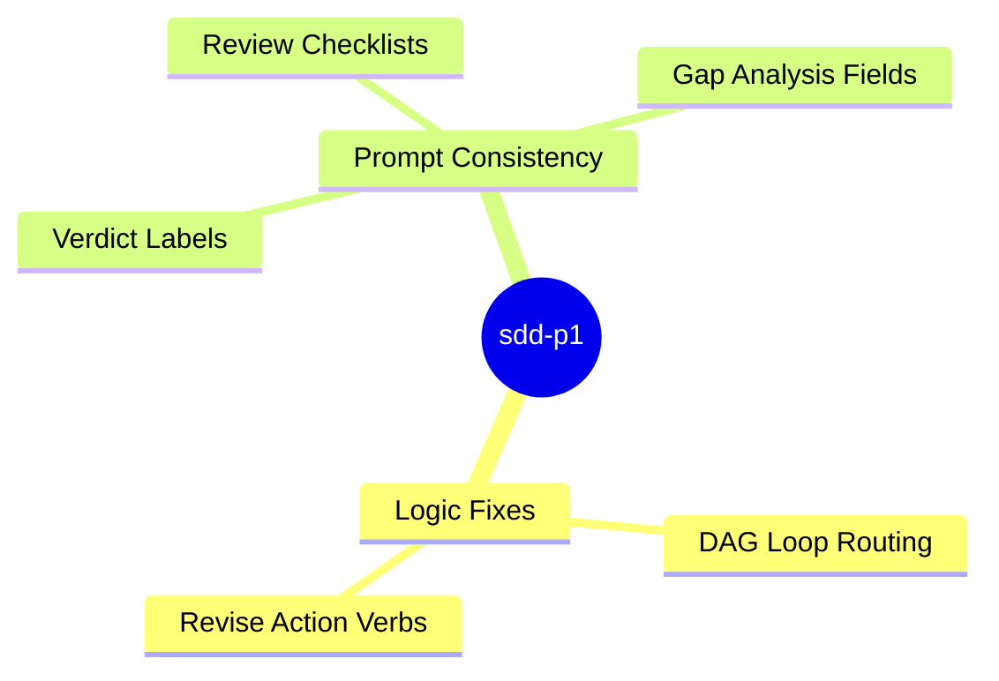

<proposal>

# Spec Navigation Map: sdd-p1

## Scope Overview (Mindmap)

## Spec Dependency Graph (Block Diagram)

## Spec Execution Order

1. **sdd-p1-dag-context-loop** — Fix DAG Context Loop Complexity Routing (#471)
   - code: crates/cclab-sdd/src/mcp/tools/run_change/dag_loop.rs
2. **sdd-p1-review-prompts** — Standardize Verdict Labels and Review Checklists (#467, #469, #470)
   - code: crates/cclab-sdd/src/mcp/tools/run_change/prompts/
3. **sdd-p1-revise-actions** — Fix Revise Actions Using Create (#468)
   - code: crates/cclab-sdd/src/mcp/tools/run_change/clarify.rs, crates/cclab-sdd/src/mcp/tools/run_change/proposal.rs

</proposal>
