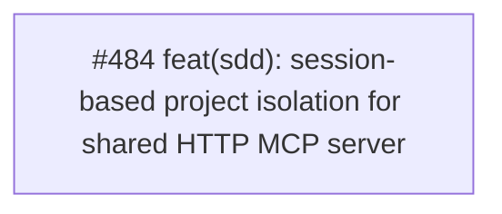

# Context Clarifications

## Q1: General
- **Question**: Affected crates
- **Answer**: cclab-server (HTTP server, session management, dynamic tools/list) and cclab-sdd (init.rs for .mcp.json generation)
- **Rationale**: 

## Q2: General
- **Question**: Approach
- **Answer**: Header-first with param-fallback. Read X-Cclab-Project on initialize, bind to Mcp-Session-Id, dynamic tools/list hides project_path when session-bound.
- **Rationale**: 

## Q3: General
- **Question**: Scope
- **Answer**: crates/cclab-server/src/http_server.rs, crates/cclab-server/src/mcp/router.rs, crates/cclab-sdd/src/cli/init.rs
- **Rationale**: 

## Dependency Graph

| Order | Issue | Depends On |
|-------|-------|------------|
| 1 | #484 — feat(sdd): session-based project isolation for shared HTTP MCP server | — |

