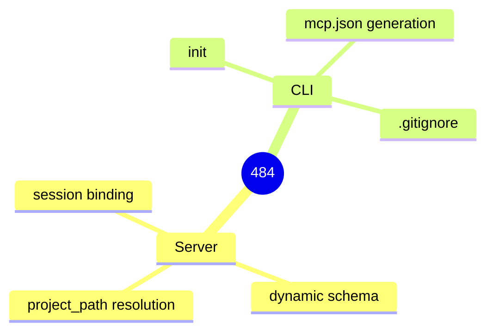

<proposal>

# Spec Navigation Map: 484

## Scope Overview (Mindmap)

## Spec Dependency Graph (Block Diagram)

## Spec Execution Order

1. **init-mcp-json** — Generate .mcp.json with Project Header in cclab init
   - code: crates/cclab-sdd/src/cli/init.rs
2. **mcp-session-binding** — MCP Session-based Project Binding
   - code: crates/cclab-server/src/http_server.rs, crates/cclab-server/src/mcp/router.rs
3. **dynamic-tool-schema** — Dynamic tools/list Schema Based on Session
   - depends: mcp-session-binding
   - code: crates/cclab-server/src/mcp/router.rs, crates/cclab-sdd/src/mcp/tools/mod.rs

</proposal>
