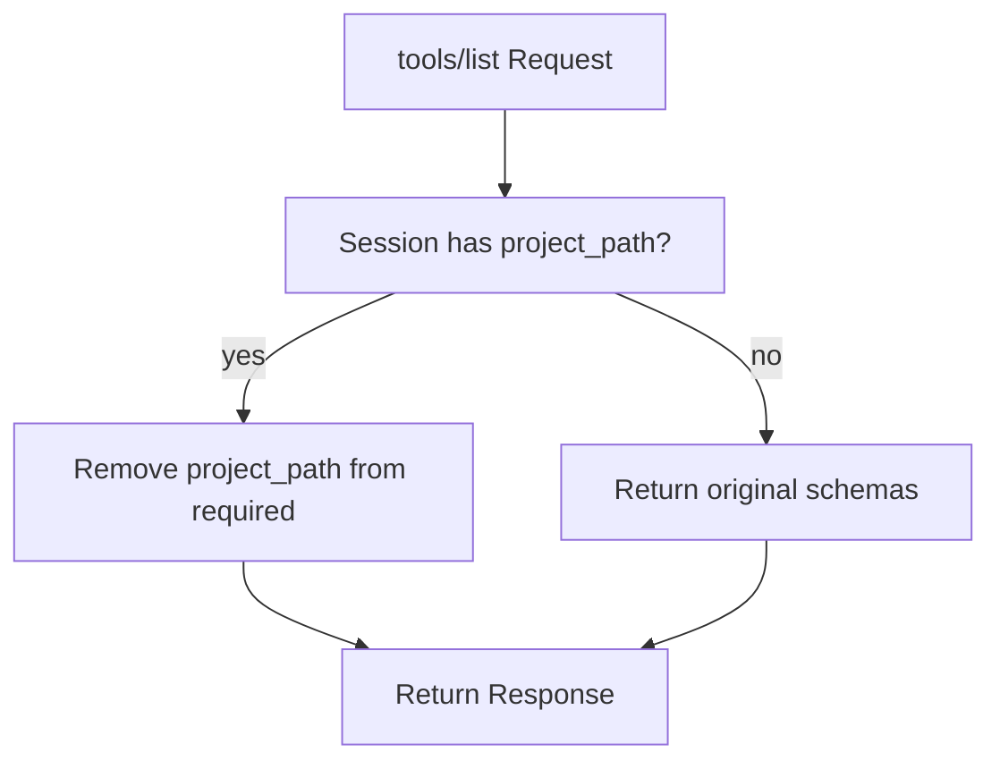

<spec>

# Dynamic tools/list Schema Based on Session

## Overview

When a session has a bound project_path (from X-Cclab-Project header), the tools/list response dynamically removes project_path from the required array of each tool's input_schema. This provides a cleaner UX for properly configured clients while maintaining backwards compatibility for unconfigured ones.

## Requirements

### R1 - Dynamic required field removal

```yaml
id: R1
priority: medium
status: draft
```

When tools/list is called and the session has a bound project_path, iterate over all tool definitions and remove 'project_path' from each tool's input_schema.required array before returning.

### R2 - No-op for unbound sessions

```yaml
id: R2
priority: medium
status: draft
```

When the session has no bound project_path, tools/list returns the original schemas unchanged (project_path remains required).

### R3 - Tool call injection

```yaml
id: R3
priority: medium
status: draft
```

When a session-bound tool call arrives without project_path in args, inject session.project_path into args before dispatching to the handler.

## Acceptance Criteria

### Scenario: Configured client lists tools

- **GIVEN** Session has bound project_path from header
- **WHEN** Client calls tools/list
- **THEN** All tool schemas show project_path as optional (not in required)

### Scenario: Unconfigured client lists tools

- **GIVEN** Session has no bound project_path
- **WHEN** Client calls tools/list
- **THEN** All tool schemas show project_path as required (unchanged)

### Scenario: Injection on tool call

- **GIVEN** Session bound to /my/project, tool call has no project_path
- **WHEN** Server dispatches tool call
- **THEN** project_path=/my/project is injected into args

## Diagrams

### tools/list Schema Decision



</spec>
