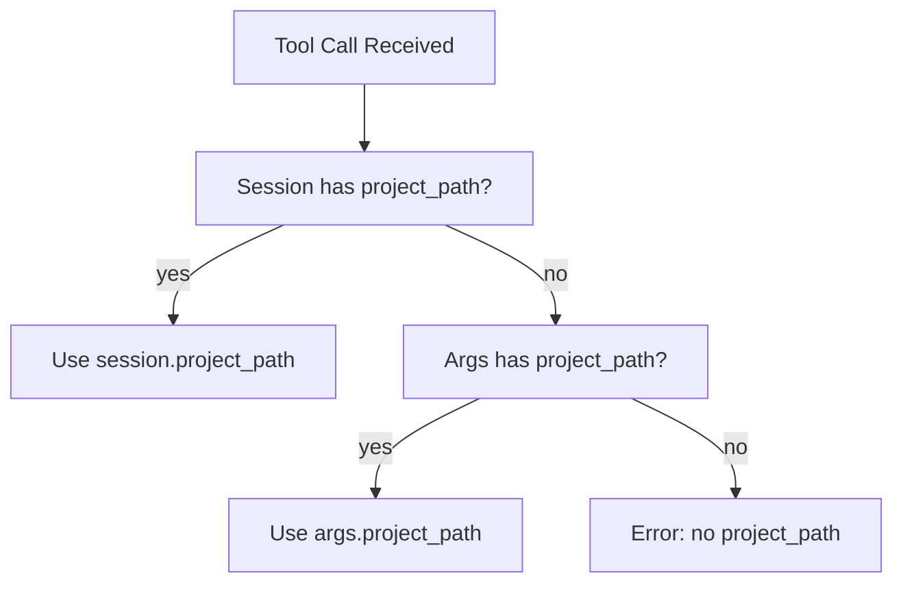

<spec>

# MCP Session-based Project Binding

## Overview

Bind project_path to MCP sessions via X-Cclab-Project HTTP header. On initialize, the server reads the header and associates it with the Mcp-Session-Id. Subsequent tool calls use the session-bound project_path, with fallback to the explicit project_path argument for backwards compatibility.

## Requirements

### R1 - Read X-Cclab-Project header on initialize

```yaml
id: R1
priority: medium
status: draft
```

When the server receives an initialize JSON-RPC request, extract the X-Cclab-Project header from the HTTP request. If present, store the value as session.project_path keyed by the Mcp-Session-Id.

### R2 - Session-bound project_path resolution

```yaml
id: R2
priority: medium
status: draft
```

On tool calls, resolve project_path with priority: (1) session.project_path if bound, (2) args.project_path if provided, (3) error. Log a warning if both exist and differ.

### R3 - Backwards compatibility

```yaml
id: R3
priority: medium
status: draft
```

When no X-Cclab-Project header is sent, behavior is unchanged — project_path remains a required tool argument.

## Acceptance Criteria

### Scenario: Client with header

- **GIVEN** MCP client sends X-Cclab-Project: /path/to/project on initialize
- **WHEN** Client calls sdd_run_change without project_path arg
- **THEN** Server uses session-bound /path/to/project

### Scenario: Client without header

- **GIVEN** MCP client sends no X-Cclab-Project header
- **WHEN** Client calls sdd_run_change with project_path=/some/path
- **THEN** Server uses /some/path from args (current behavior)

### Scenario: Mismatch warning

- **GIVEN** Session bound to /project-a
- **WHEN** Tool call passes project_path=/project-b
- **THEN** Server logs warning, uses session.project_path

## Diagrams

### Project Path Resolution



</spec>
