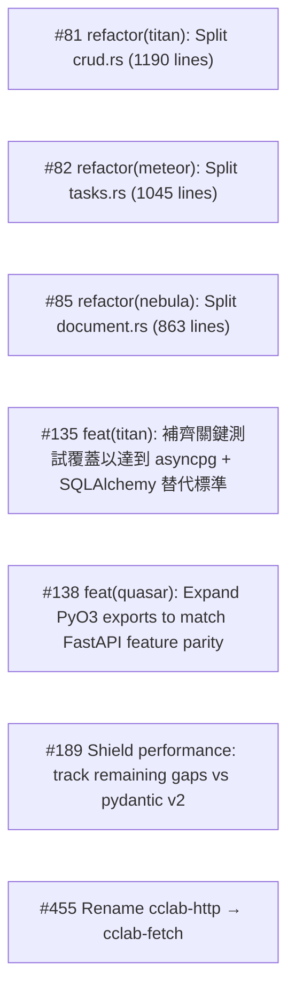

# Context Clarifications

## Q1: General
- **Question**: Scope confirmation
- **Answer**: All 7 P0+P1 pylibs issues in one change: #81, #82, #135, #85, #138, #189, #455
- **Rationale**: 

## Q2: General
- **Question**: Git workflow
- **Answer**: in_place on sdd-and-mamba branch
- **Rationale**: 

## Q3: General
- **Question**: Any additional clarifications needed?
- **Answer**: No — all issues have clear task definitions, suggested file structures, requirements, and acceptance criteria
- **Rationale**: 

## Dependency Graph

| Order | Issue | Depends On |
|-------|-------|------------|
| 1 | #81 — refactor(titan): Split crud.rs (1190 lines) | — |
| 2 | #82 — refactor(meteor): Split tasks.rs (1045 lines) | — |
| 3 | #85 — refactor(nebula): Split document.rs (863 lines) | — |
| 4 | #135 — feat(titan): 補齊關鍵測試覆蓋以達到 asyncpg + SQLAlchemy 替代標準 | — |
| 5 | #138 — feat(quasar): Expand PyO3 exports to match FastAPI feature parity | — |
| 6 | #189 — Shield performance: track remaining gaps vs pydantic v2 | — |
| 7 | #455 — Rename cclab-http → cclab-fetch | — |

