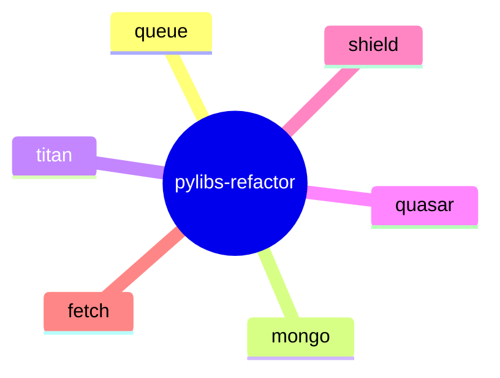

<proposal>

# Spec Navigation Map: pylibs-refactor

## Scope Overview (Mindmap)

## Spec Dependency Graph (Block Diagram)

## Spec Execution Order

1. **fetch-migration-cleanup** — Complete cclab-http to cclab-fetch Migration
   - code: crates/cclab-http/, crates/cclab-fetch/, Cargo.toml
2. **mongo-pyo3-refactor** — Refactor cclab-mongo PyO3 Bindings
   - code: crates/cclab-mongo/src/pyo3_bindings/document.rs, crates/cclab-mongo/src/pyo3_bindings/query.rs
3. **quasar-pyo3-expansion** — Expand cclab-quasar PyO3 Exports for FastAPI Parity
   - code: crates/cclab-quasar/src/pyo3_bindings/
4. **queue-pyo3-refactor** — Refactor cclab-queue PyO3 Bindings
   - code: crates/cclab-queue/src/pyo3_bindings/mod.rs
5. **shield-performance-opt** — Optimize cclab-shield JSON-to-Model Performance
   - code: crates/cclab-shield/src/
6. **titan-test-expansion** — Expand cclab-titan Integration Tests
   - code: crates/cclab-titan/tests/, crates/cclab-titan/src/pool.rs, crates/cclab-titan/src/error.rs

</proposal>
