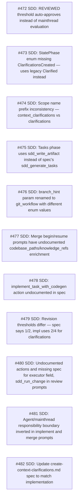

# Context Clarifications

## Q1: Direction for spec-vs-impl mismatches
- **Question**: For all 11 P2 issues where spec and implementation disagree, should we update specs to match impl, or update impl to match specs?
- **Answer**: Spec follows implementation. The current Rust implementation is correct and working. Update all specs to document actual behavior.
- **Rationale**: 

## Q2: Affected scope
- **Question**: Which crates/paths are affected?
- **Answer**: cclab/specs/ — spec markdown files only. No Rust code changes needed since implementation is correct.
- **Rationale**: 

## Q3: Git workflow
- **Question**: Git workflow?
- **Answer**: in_place on sdd-and-mamba branch.
- **Rationale**: 

## Dependency Graph

| Order | Issue | Depends On |
|-------|-------|------------|
| 1 | #472 — SDD: REVIEWED threshold auto-approves instead of mainthread evaluation | — |
| 2 | #473 — SDD: StatePhase enum missing ClarificationsCreated — uses legacy Clarified instead | — |
| 3 | #474 — SDD: Scope name prefix inconsistency — context_clarifications vs clarifications | — |
| 4 | #475 — SDD: Tasks phase uses sdd_write_artifact instead of spec's sdd_generate_tasks | — |
| 5 | #476 — SDD: branch_hint param renamed to git_workflow with different enum values | — |
| 6 | #477 — SDD: Merge begin/resume prompts have undocumented codebase_paths/knowledge_refs enrichment | — |
| 7 | #478 — SDD: implement_task_with_codegen action undocumented in spec | — |
| 8 | #479 — SDD: Revision thresholds differ — spec says 1/2, impl uses 2/4 for clarifications | — |
| 9 | #480 — SDD: Undocumented actions and missing spec for executor field, sdd_run_change in review prompts | — |
| 10 | #481 — SDD: Agent/mainthread responsibility boundary inverted in implement and merge prompts | — |
| 11 | #482 — SDD: Update create-context-clarifications.md spec to match implementation | — |

