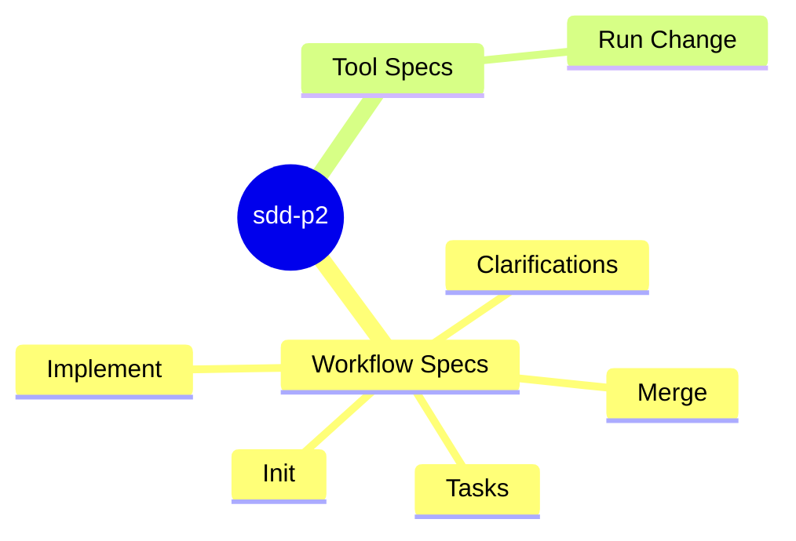
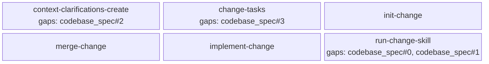

<proposal>

# Spec Navigation Map: sdd-p2

## Scope Overview (Mindmap)

## Spec Dependency Graph (Block Diagram)

## Spec Execution Order

1. **change-tasks** — Change Tasks
2. **context-clarifications-create** — Create Context Clarifications
3. **implement-change** — Implement Change
4. **init-change** — Init Change
5. **merge-change** — Merge Change
6. **run-change-skill** — Run Change Skill

</proposal>
