# Context Clarifications

## Q1: General
- **Question**: 
- **Answer**: Download raw files from github.com/python/cpython tree v3.12.0 Lib/test/. Extract parse-able syntax — strip unittest class structure, runtime assertions, and stdlib imports. Keep all Python syntax constructs intact.
- **Rationale**: 

## Q2: General
- **Question**: 
- **Answer**: Strip test class boilerplate and extract actual Python syntax as standalone code. Add # RUN: parse as first line.
- **Rationale**: 

## Q3: General
- **Question**: 
- **Answer**: Per CLAUDE.md, files >= 1000 lines must be split, >= 500 lines should consider split. Split large CPython files into multiple fixtures if needed.
- **Rationale**: 

## Q4: General
- **Question**: 
- **Answer**: CPython imports -> tests/fixtures/parse/cpython/stdlib/. Edge-case fixtures -> tests/fixtures/parse/edge_cases/. Negative tests -> tests/fixtures/parse/negative/. Stress tests -> tests/fixtures/parse/stress/
- **Rationale**: 

## Q5: General
- **Question**: 
- **Answer**: cargo test --test fixture_tests must pass for all new fixtures.
- **Rationale**: 

## Q6: General
- **Question**: 
- **Answer**: If mamba parser doesn't support some syntax, document as known limitation, skip that portion or create a separate bug issue. Maximize coverage, not 100% on day one.
- **Rationale**: 

## Q7: General
- **Question**: 
- **Answer**: Implement first since negative parse tests (#566) depend on it. Modify run_parse() in fixture_tests.rs to check directives.expect_error and verify parse failure.
- **Rationale**: 

## Dependency Graph

| Order | Issue | Depends On |
|-------|-------|------------|
| 1 | #510 — Add CPython 3.12 test_grammar.py as parse-only fixture | — |
| 2 | #511 — Add CPython 3.12 operator & call expression fixtures (test_augassign, test_binop, test_call, test_extcall) | — |
| 3 | #512 — Add CPython 3.12 test_named_expressions.py as parse-only fixture (walrus operator) | — |
| 4 | #513 — Add CPython 3.12 test_patma.py as parse-only fixture (pattern matching) | — |
| 5 | #514 — Add CPython 3.12 unpacking fixtures (test_unpack, test_unpack_ex) | — |
| 6 | #515 — Add CPython 3.12 type system fixtures (test_type_aliases, test_type_annotations, test_type_comments, test_type_params, test_pep646_syntax) | — |
| 7 | #516 — Add CPython 3.12 generator fixtures (test_generators, test_genexps, test_generator_stop, test_yield_from) | — |
| 8 | #517 — Add CPython 3.12 async fixtures (test_coroutines, test_asyncgen, test_contextlib_async) | — |
| 9 | #518 — Add CPython 3.12 comprehension fixtures (test_listcomps, test_dictcomps, test_setcomps) | — |
| 10 | #519 — Add CPython 3.12 exception fixtures (test_exceptions, test_baseexception, test_exception_group, test_exception_hierarchy, test_exception_variations) | — |
| 11 | #550 — Add targeted fixture: walrus operator (:=) edge cases | — |
| 12 | #551 — Add targeted fixture: complex f-string nesting edge cases | — |
| 13 | #552 — Add targeted fixture: match statement advanced patterns | — |
| 14 | #553 — Add targeted fixture: starred expressions & unpacking in all contexts | — |
| 15 | #554 — Add targeted fixture: async syntax edge cases | — |
| 16 | #559 — Add targeted fixture: type parameter syntax (PEP 695) | — |
| 17 | #560 — Add targeted fixture: exception group syntax (PEP 654) | — |
| 18 | #561 — Add targeted fixture: complex string literals & escape sequences | — |
| 19 | #566 — Add negative parse test suite: syntax errors that MUST be rejected | — |
| 20 | #567 — Add PEP 701 relaxed f-string grammar tests (Python 3.12 specific) | — |
| 21 | #568 — Add parenthesized context managers fixture (PEP 617) | — |
| 22 | #569 — Add soft keywords interaction tests (match, case, type) | — |
| 23 | #570 — Add operator precedence comprehensive test fixture | — |
| 24 | #571 — Add deeply nested expression stress test fixture | — |
| 25 | #572 — Add complex import statement patterns fixture | — |
| 26 | #573 — Add multi-line expression continuation patterns fixture | — |
| 27 | #574 — Add complex class definition syntax fixture | — |
| 28 | #575 — Add complex function signature syntax fixture | — |
| 29 | #576 — Add try/except/else/finally combination tests | — |
| 30 | #629 — Enhance fixture test harness: support EXPECT-ERROR for negative parse tests | — |

```mermaid
graph LR
    510["#510 Add CPython 3.12 test_grammar.py as parse-only fixture"]
    511["#511 Add CPython 3.12 operator & call expression fixtures (test_augassign, test_binop, test_call, test_extcall)"]
    512["#512 Add CPython 3.12 test_named_expressions.py as parse-only fixture (walrus operator)"]
    513["#513 Add CPython 3.12 test_patma.py as parse-only fixture (pattern matching)"]
    514["#514 Add CPython 3.12 unpacking fixtures (test_unpack, test_unpack_ex)"]
    515["#515 Add CPython 3.12 type system fixtures (test_type_aliases, test_type_annotations, test_type_comments, test_type_params, test_pep646_syntax)"]
    516["#516 Add CPython 3.12 generator fixtures (test_generators, test_genexps, test_generator_stop, test_yield_from)"]
    517["#517 Add CPython 3.12 async fixtures (test_coroutines, test_asyncgen, test_contextlib_async)"]
    518["#518 Add CPython 3.12 comprehension fixtures (test_listcomps, test_dictcomps, test_setcomps)"]
    519["#519 Add CPython 3.12 exception fixtures (test_exceptions, test_baseexception, test_exception_group, test_exception_hierarchy, test_exception_variations)"]
    550["#550 Add targeted fixture: walrus operator (:=) edge cases"]
    551["#551 Add targeted fixture: complex f-string nesting edge cases"]
    552["#552 Add targeted fixture: match statement advanced patterns"]
    553["#553 Add targeted fixture: starred expressions & unpacking in all contexts"]
    554["#554 Add targeted fixture: async syntax edge cases"]
    559["#559 Add targeted fixture: type parameter syntax (PEP 695)"]
    560["#560 Add targeted fixture: exception group syntax (PEP 654)"]
    561["#561 Add targeted fixture: complex string literals & escape sequences"]
    566["#566 Add negative parse test suite: syntax errors that MUST be rejected"]
    567["#567 Add PEP 701 relaxed f-string grammar tests (Python 3.12 specific)"]
    568["#568 Add parenthesized context managers fixture (PEP 617)"]
    569["#569 Add soft keywords interaction tests (match, case, type)"]
    570["#570 Add operator precedence comprehensive test fixture"]
    571["#571 Add deeply nested expression stress test fixture"]
    572["#572 Add complex import statement patterns fixture"]
    573["#573 Add multi-line expression continuation patterns fixture"]
    574["#574 Add complex class definition syntax fixture"]
    575["#575 Add complex function signature syntax fixture"]
    576["#576 Add try/except/else/finally combination tests"]
    629["#629 Enhance fixture test harness: support EXPECT-ERROR for negative parse tests"]
```

