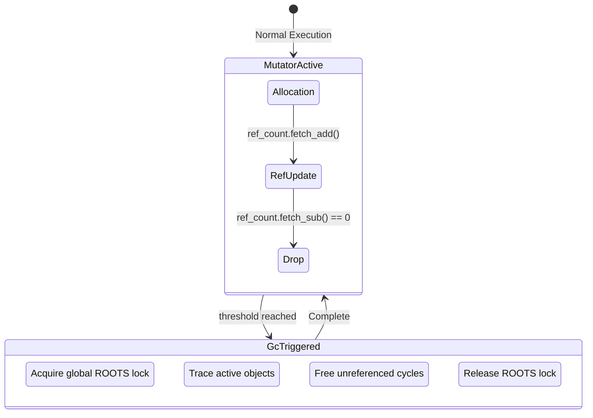
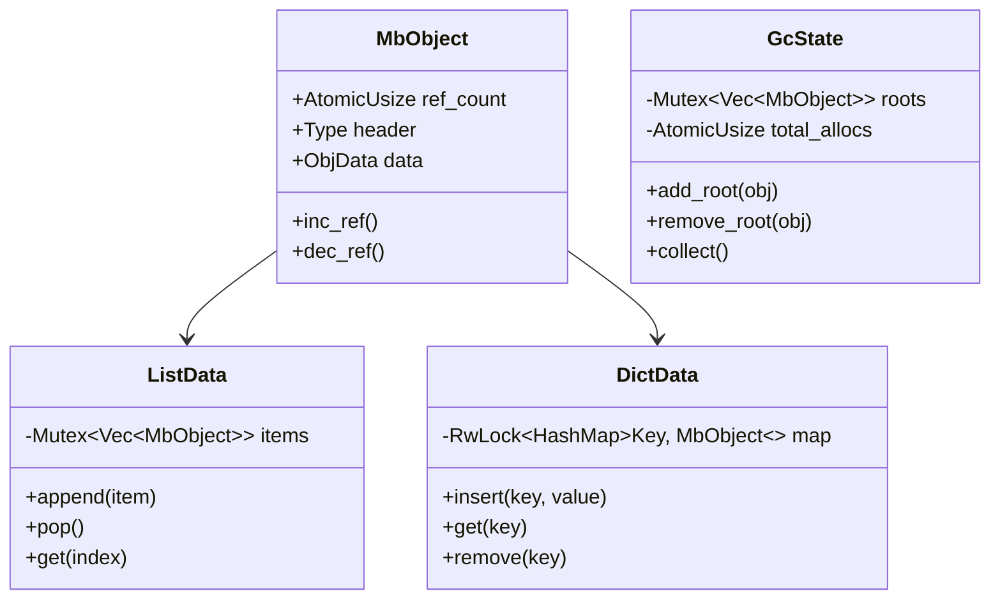

# Mamba Thread Safe And No Gil Spec

## Overview

This specification outlines the architectural changes required to make the Mamba runtime thread-safe, enabling execution without a Global Interpreter Lock (GIL). Currently, Mamba uses non-atomic reference counting and thread-local state for garbage collection and root management, which inherently limits execution to a single thread or requires a GIL for concurrency. To achieve a no-GIL architecture, we will transition `MbObject` reference counting to use atomic operations (`AtomicU32`/`AtomicUsize`), redesign the `GcState` and `ROOTS` management to be globally thread-safe, and implement synchronization mechanisms (e.g., per-object locks) for core mutable collection types like `List`, `Dict`, and `Set` to prevent data races. Note that changes to async scheduling are deferred to a subsequent update.
## Requirements

### R1: Atomic Reference Counting
The `MbObject` reference count must be managed atomically using `AtomicU32` or `AtomicUsize` with appropriate memory ordering (Acquire/Release) to prevent race conditions during reference adjustments across multiple threads.

### R2: Global Thread-Safe Garbage Collection State
The `GcState` and `ROOTS` storage must be redesigned from `thread_local!` or non-sync global state to thread-safe data structures (e.g., using `Mutex`, `RwLock`, or lock-free concurrent structures) to support a unified garbage collection context shared by all execution threads.

### R3: Thread-Safe Core Collections
Core mutable collection types (e.g., `List`, `Dict`, `Set`) must implement internal synchronization (such as per-object locks or fine-grained locking) to ensure thread-safe concurrent mutations and read accesses.

### R4: No-GIL Execution Concurrency
The Mamba runtime must support evaluating multiple threads concurrently without a Global Interpreter Lock (GIL). All internal object allocations, reference adjustments, and GC sweeps must execute without depending on GIL semantics.

### R5: Deferred Async Scheduling Changes
Changes related to the coroutine scheduling relying on GIL acquire/release (as specified in async specs) are out of scope for this change and will be maintained as single-threaded until a subsequent async no-GIL redesign.
## Scenarios

### Scenario: Concurrent Object Creation and Reference Counting
- **WHEN** multiple threads simultaneously allocate new `MbObject` instances and increment/decrement their reference counts.
- **THEN** no memory leaks or double-frees occur, and reference counts remain exactly accurate, guaranteed by atomic operations.

### Scenario: Concurrent Collection Mutation
- **WHEN** Thread A appends an item to a shared `List` while Thread B concurrently removes an item from the same `List`.
- **THEN** the `List` maintains structural integrity, both operations succeed in a deterministic serialized order (via per-object locks), and no data races or segmentation faults occur.

### Scenario: Global Garbage Collection Sweep
- **WHEN** a garbage collection cycle is triggered while multiple threads are actively modifying object graphs.
- **THEN** the GC successfully traverses the global `ROOTS` safely, without missing objects newly created by other threads, and without interfering with concurrent object accesses beyond expected synchronization points.

### Scenario: Concurrent Read/Write on a Dict
- **WHEN** Thread A writes a new key-value pair to a shared `Dict` while Thread B reads a value from a different key in the same `Dict`.
- **THEN** the reader (Thread B) safely retrieves the value or misses the new key without experiencing memory corruption or iterator invalidation.
## Diagrams

### State Diagram



### Class Diagram


## API Spec

## Test Plan

```mermaid
---
config:
  requirement:
    title: Mamba Thread-Safe No-GIL Verification
---
requirementDiagram
    requirement "R1: Atomic RC" {
        id r1
        text "Use AtomicUsize/AtomicU32 for MbObject reference counts"
        risk Medium
        verification Test
    }

    requirement "R3: Thread-Safe Collections" {
        id r3
        text "Per-object locks for List, Dict, Set"
        risk High
        verification Test
    }

    element "RC Stress Test" {
        type test
        test_type integration
        given "Shared MbObject instances across 100 threads"
        when "Concurrent inc_ref and dec_ref are called"
        then "Final ref count exactly matches expected value with no leaks"
    }

    element "List Mutation Test" {
        type test
        test_type integration
        given "A shared List object accessed by N threads"
        when "Threads concurrently append and pop items"
        then "List length and contents are consistent with total operations"
    }

    r1 - verifies -> "RC Stress Test"
    r3 - verifies -> "List Mutation Test"
```
## Changes

- `crates/mamba/src/runtime/object.rs`: Modify `MbObject` header to use `AtomicUsize` for ref counting.
- `crates/mamba/src/runtime/gc.rs`: Refactor `GcState` and `ROOTS` to use standard sync primitives (`Mutex`/`RwLock`) instead of `thread_local!`.
- `crates/mamba/src/runtime/collections/list.rs`: Add per-object locking (`Mutex` or `RwLock`) to `List` operations.
- `crates/mamba/src/runtime/collections/dict.rs`: Add per-object locking to `Dict` operations.
- `crates/mamba/src/runtime/collections/set.rs`: Add per-object locking to `Set` operations.
- `crates/mamba/tests/thread_safety_tests.rs`: Add integration tests covering concurrent RC modifications and collection mutations.
# Reviews
