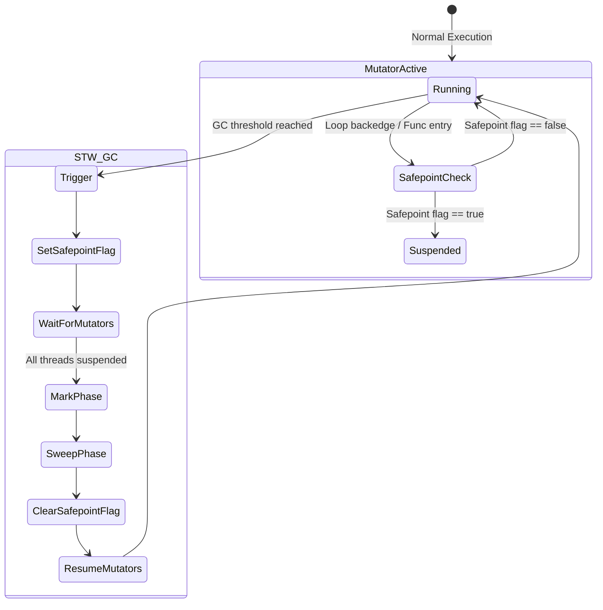
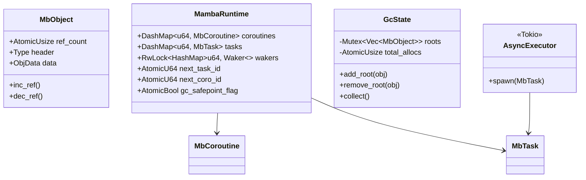

# Mamba Thread Safe Spec

## Overview

This specification updates the Mamba thread-safe runtime design to fully support multi-threaded execution without a Global Interpreter Lock (GIL). It builds upon previous atomic reference counting and fine-grained locking efforts by addressing the remaining `thread_local!` bottlenecks. Specifically, this spec defines the migration of async state (coroutines, tasks, wakers, timers) to globally synchronized collections, enabling integration with Tokio's multi-threaded executor for true parallel async I/O. Furthermore, it outlines a cooperative safepoint-based Stop-The-World (STW) mechanism for garbage collection, ensuring that root scanning across all mutator threads is thread-safe and robust. Together, these changes complete the transition to a concurrent, no-GIL runtime architecture.
## Requirements

### R1: Atomic Reference Counting
The `MbObject` reference count must be managed atomically using `AtomicU32` or `AtomicUsize` with appropriate memory ordering (Acquire/Release) to prevent race conditions during reference adjustments across multiple threads.

### R2: Thread-Safe Core Collections
Core mutable collection types (e.g., `List`, `Dict`, `Set`) must implement internal synchronization (such as per-object locks or fine-grained locking) to ensure thread-safe concurrent mutations and read accesses.

### R3: No-GIL Execution Concurrency
The Mamba runtime must support evaluating multiple threads concurrently without a Global Interpreter Lock (GIL). All internal object allocations, reference adjustments, and GC sweeps must execute without depending on GIL semantics.

### R4: Safepoint-based Stop-the-World GC
The garbage collection logic must implement a robust "Stop-the-World" (STW) mechanism using cooperative safepoints. The interpreter must periodically check a global safepoint flag (e.g., at function entries and loop backedges) to safely pause all mutator threads, allowing the GC to accurately scan roots across all threads.

### R5: Global Shared Async State
All `thread_local!` state related to async execution (e.g., `COROUTINES`, `TASKS`, `WAKERS`, `TIMERS`) must be consolidated into a globally shared `MambaRuntime` struct using synchronized collections like `DashMap` or `RwLock<HashMap>`.

### R6: Tokio Executor Integration
`MbTask` and `MbCoroutine` must be updated to be `Send` + `Sync`, enabling them to be safely sent and shared across OS threads. Mamba tasks must be integrated with Tokio's multi-threaded executor for true parallel async I/O.

### R7: Atomic Global Counters
All ID allocation logic (e.g., `alloc_coro_id`, `alloc_task_id`) must use `AtomicU64` counters instead of thread-local increments to guarantee globally unique identifiers across all execution threads.
## Scenarios

### Scenario: Concurrent Object Creation and Reference Counting
- **WHEN** multiple threads simultaneously allocate new `MbObject` instances and increment/decrement their reference counts.
- **THEN** no memory leaks or double-frees occur, and reference counts remain exactly accurate, guaranteed by atomic operations.

### Scenario: Concurrent Collection Mutation
- **WHEN** Thread A appends an item to a shared `List` while Thread B concurrently removes an item from the same `List`.
- **THEN** the `List` maintains structural integrity, both operations succeed in a deterministic serialized order (via per-object locks), and no data races or segmentation faults occur.

### Scenario: Global Garbage Collection Sweep with Safepoints
- **WHEN** a garbage collection cycle is triggered while multiple threads are actively executing and modifying object graphs.
- **THEN** all mutator threads promptly reach a safepoint and pause. The GC safely traverses the global `ROOTS` along with all thread-local roots, marks active objects, sweeps unreferenced cycles, and then resumes the mutator threads.

### Scenario: Multi-threaded Async Task Execution
- **WHEN** a Mamba program spawns multiple async tasks that yield to the event loop.
- **THEN** the underlying Tokio executor schedules and distributes the tasks across multiple OS threads, safely updating task states and handling wakeups via the globally synchronized `MambaRuntime` collections.
## Diagrams

### State Diagram



### Class Diagram


## API Spec

## Test Plan

```mermaid
---
config:
  requirement:
    title: Mamba Thread-Safe Async and GC Verification
---
requirementDiagram
    requirement "R4: Safepoint-based STW GC" {
        id r4
        text "Safepoint checks to pause threads for GC"
        risk High
        verification Test
    }

    requirement "R5: Global Shared Async State" {
        id r5
        text "Async state migrated to globally shared DashMap"
        risk High
        verification Test
    }

    requirement "R6: Tokio Executor Integration" {
        id r6
        text "Tasks execute on Tokio multi-threaded executor"
        risk High
        verification Test
    }

    element "GC Safepoint Test" {
        type test
        test_type integration
        given "Multiple mutator threads running tight loops"
        when "GC is triggered forcefully"
        then "All threads pause at safepoints, GC completes, and threads resume safely"
    }

    element "Async Task Spawning Test" {
        type test
        test_type integration
        given "A multi-threaded Tokio runtime"
        when "Mamba spawns 100 concurrent async tasks doing I/O"
        then "Tasks complete correctly without data races on runtime state"
    }

    r4 - verifies -> "GC Safepoint Test"
    r5 - verifies -> "Async Task Spawning Test"
    r6 - verifies -> "Async Task Spawning Test"
```
## Changes

- `crates/mamba/src/runtime/gc.rs`: Refactor GC to use a safepoint-based Stop-The-World approach. Implement root scanning across all mutator threads.
- `crates/mamba/src/runtime/state.rs` (or equivalent runtime state file): Create `MambaRuntime` to hold globally synchronized async states (`COROUTINES`, `TASKS`, `WAKERS`, `TIMERS`) using `DashMap` and `RwLock`.
- `crates/mamba/src/runtime/task.rs`: Update `MbTask` and `MbCoroutine` to be `Send` + `Sync`. Integrate with Tokio for multi-threaded scheduling.
- `crates/mamba/src/interpreter/vm.rs`: Insert safepoint polling checks (`gc_safepoint_flag`) at function entries and loop backedges.
- `crates/mamba/src/runtime/id.rs` (or identifier allocation logic): Replace thread-local ID generation with `AtomicU64` for `alloc_coro_id` and `alloc_task_id`.
- `crates/mamba/src/runtime/collections/*.rs`: Ensure `List`, `Dict`, `Set` implement thread-safe locking (if not fully completed in prior phase).
- `crates/mamba/tests/thread_safety_tests.rs`: Add integration tests for GC safepoints and multi-threaded Tokio async task execution.
# Reviews
